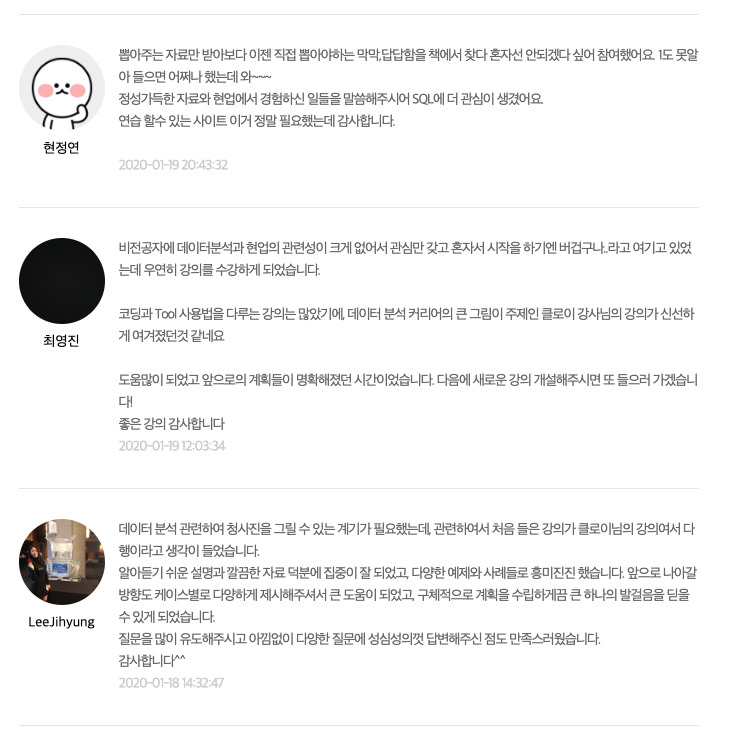

<!--  
# 안녕하세요, Chloe 입니다. &#9997; -->
{: style="float: left; margin:5px 15px 5px 0;"}
안녕하세요, 데이터 분석가 Chloe입니다. 이 페이지는 기록을 목적으로 만든 블로그입니다.

## 경력 &#9994;

|       | 업무 | 기간 |
|:-----------------|:----------------------|:-----------------|
| **Viva Republica**  | Data Analyst     | 2020.02-현재 |
| **Moloco**  | Data Analyst, Technical Account Manager                | 2019.08-2020.02 |
| **Naver Clova**  | 프로덕트 매니저                | 2018.11-2019.07 |
| **Korea Credit Bureau** | 데이터 분석가, 통계 모형 개발 | 2012.12-2018.11 |

### 데이터 분석 경험 확장  
첫 직장이였던 개인신용평가회사 [코리아크레딧뷰로](https://ko.wikipedia.org/wiki/%EC%BD%94%EB%A6%AC%EC%95%84%ED%81%AC%EB%A0%88%EB%94%A7%EB%B7%B0%EB%A1%9C)에서는 <U>RDB를 이해하고 복잡한 DB에서의 데이터 추출과 분석</U> 에 많은 경험을 쌓았습니다. 데이터 구조와 적재에 대한 이해의 폭을 넓힐 수 있는 기회였습니다.  
우리나라 다수 금융기관의 <U>신용평가시스템(Credit Scoring System)을 개발</U>하였고,
은행업권, 카드업권, 저축은행업권의 <U>시장 환경에 따른 데이터 분석 및 모델링 업무</U>를 수행하였습니다.

 

### 기술과 변화하는 세상에 대한 관심
알파고의 등장 후, 필연적으로 그리고 자연스레 AI 기술에 관심을 가지게 되었습니다.
유난히 빠른 기술 발전 속도에 감탄하며 그에 맞는 사업 기획의 업무를 본격적으로 진행하고 싶어 이직을 결정하였습니다.
Tech 회사에서 B2B, B2C의 다양한 업무를 진행하며 경험을 쌓고 있습니다. <U>웹/앱 서비스 기획</U>, <U>UX 디자인</U> 등 서비스 기획을 접하고 있고 팀 내 <U>기획 업무</U>(서비스 pricing 결정, data annotation guideline 작성, 스케줄 조정 및 확인 등)를 맡고 있어 <U>Tech 회사에서의 management</U>에 대한 훈련을 하고 있습니다.

앞으로도 세상에 대한 관심을 여러 방면으로 표현해보려 합니다.

 

## 교육 &#127891;

| 학교        | 전공 | 기간 |
|:-----------------|:----------------------|:-----------------|
| **한국과학기술원(KAIST)**           | Professional MBA                                | 2018.02-현재 |
| **Rice University** | Statistics, Financial Computation and Modeling  | 2008.08-2012.05 |

 

## 발표 자료 &#x1F4CB;
 - **데이터 분석 공부법**, 2019
 : `탈잉`이라는 교육 플랫폼에서의 제의로 `입문자들을 위한 데이터 분석 강의`를 진행하였습니다. 데이터 분석이란 무엇인지, 비전공자가 접근하기 위해서는 무엇부터 알면 좋을지, 인사이트를 도출하는 과정 등 non-실무자가 궁금할만한 궁금증을 해결해주는 시간이었습니다.
  

 - **딥러닝 기본 원리의 이해**, 2018 ([링크](https://www.slideshare.net/HeeWonPark11))
 : 처음 딥러닝 공부를 시작할 때에는 한글 자료도 많지 않았었고 명쾌한 설명도 드물어 구글링을 많이 했었습니다. 여러 커뮤니티의 해석이 이해에 큰 도움이 되어 저도 제가 해석한 바를 다른 입문자들과 공유하고 함께 이야기 하고 싶어 만든 자료입니다.

 

## 원서 번역(2020 출판 예정) &#x1F4D6;
  - [**Recommender Systems: The Textbook, Charu C. Aggarwal**](https://www.amazon.com/Recommender-Systems-Textbook-Charu-Aggarwal/dp/3319296574)
  : 추천 시스템에 관심이 생겨 시작하게 된 해외 원서 번역 작업입니다. 원서 자체가 '추천 시스템의 바이블'이라고 할 만큼 워낙 내용이 알차서 거절할 수가 없었던 사이드 프로젝트였습니다. 국내에는 추천 시스템 관련 서적이 부족한 만큼 여러모로 도움이 많이 되는 번역본이면 좋겠습니다.
