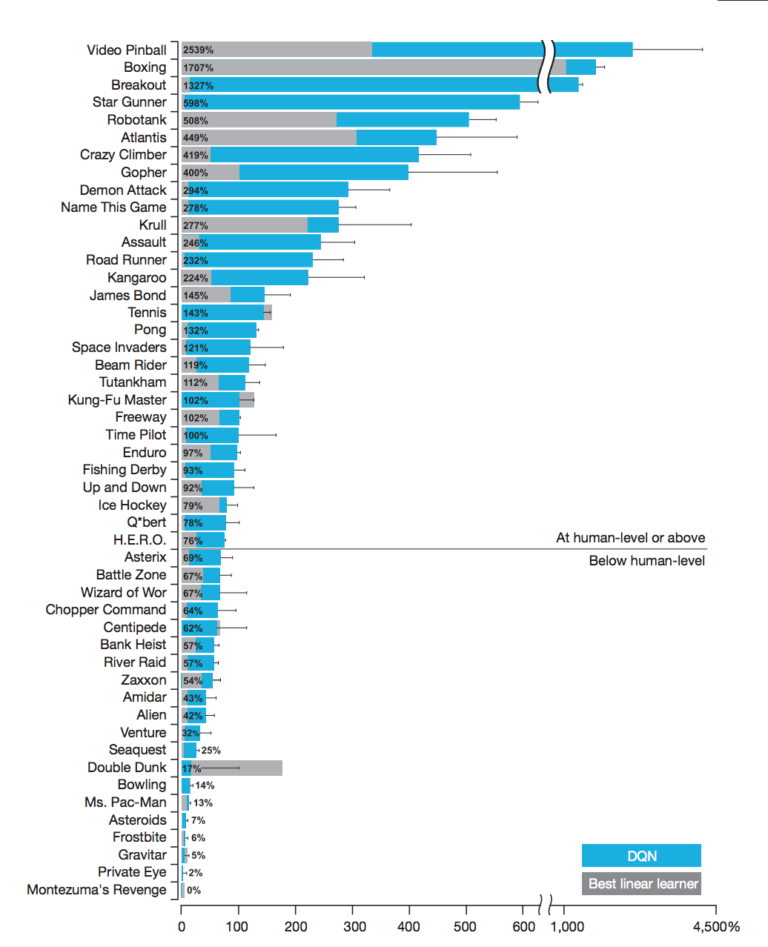

##### 본 글은 [Yaron Hadad의 블로그](http://www.yaronhadad.com/deep-learning-most-amazing-applications/)를 동의 하에 번역하였습니다.

최근 몇 년간 딥러닝은 컴퓨터 비전부터 자연어 처리까지 수많은 문제들을 해결하는데 쓰였습니다. 다수의 경우 딥러닝은 이전의 작업보다 더 좋은 성능을 보이고 있습니다. 딥러닝은 학계, 산업 모두 큰 비중을 차지하며 인간이 겪은 여러 문제들을 해결하고 있습니다.

이 글의 목적은 딥러닝이 과연 어느 분야에 뛰어나게 쓰이고 있는지 제가 아는 선에서 말씀드리려 합니다. 이 글이 여러분이 딥러닝 분야에 재미를 느낄 수 있게 도움이 되었으면 하는 바람과 동시에 새로운 기술의 발전이 잠재적 위험을 동시에 불러일으킬 수 있다는 점도 기억하셨으면 좋겠습니다. 저는 후자의 경우 딥러닝 분야에서 실제로 크게 작용하고 있다고 생각하며 이 주제에 대해서 많은 사람들이 언급하고 함께 이야기해보는 시간을 가지면 좋겠습니다.

정말 많은 분야에서 딥러닝이 쓰이고 있기 때문에 아래의 예제는 단순히 그 일부분일 뿐입니다. 큰 카테고리별로 나눠보겠습니다.

*컴퓨터 비전(Computer Vision)과 패턴 인식(Pattern recognition)* 
*컴퓨터 게임, 로봇 & 자율주행* 
*소리(Sound)* 
*미술(Art)* 
*Computer hallucination, 예측(Predict), 그 외* 

 
## 컴퓨터 비전(Computer vision)과 패턴 인식(Pattern recognition)

### 1. 정치인 재연해보기

워싱턴 대학의 한 그룹은 오디오를 이용해서 비디오의 입술 움직임을 합성한 결과물을 소개하였습니다. Obama를 대상으로 꽤 눈에 띄는 비디오를 만들었는데, 영상에 대한 논문은 [링크](http://grail.cs.washington.edu/projects/AudioToObama/siggraph17_obama.pdf)를 따라가시면 됩니다.

 

 

### 2. 흑백 사진과 영상에 색 복원하기
흑백사진 싫어하세요? 걱정 마세요. [“Let there be color!”](http://dl.acm.org/citation.cfm?id=2925974) 는 자동으로 흑백사진을 색이 있는 사진으로 바꿔주는 시스템입니다. 더 자세한 내용은 [여기](http://hi.cs.waseda.ac.jp/~iizuka/projects/colorization/en/)를 참고하시고 [예제](http://hi.cs.waseda.ac.jp/~iizuka/projects/colorization/extra.html)도 함께 보시죠.

 
비슷한 방법으로 흑백 필름(film)에 색을 입히기도 하죠.

 
딥러닝 네트워크는 사진에서 일어나는 실제 패턴을 학습합니다 - 재복원하려면 하늘은 대체로 파란색이고 구름은 하얀색/회색을, 잔디는 초록색을 띠고 있다는 점을 학습하는 것입니다. 이러한 작업도 인간의 개입 없이 과거 경험을 바탕으로 스스로 학습을 합니다. 가끔 실수를 하기도 하지만 잘 보이진 않아요. 예를 들어서 아래 두 개의 흑백 사진에 대한 실제 색이 입혀진 사진과 컴퓨터가 색을 추측하여 입힌 사진이 있습니다. 어떤 게 진짜 이미지 같나요?

 

 

### 3. CSI스타일의 픽셀 복원
CSI라는 미국 드라마를 보시면 실제 비디오를 확대하는 경우가 있습니다. 이 점은 시청자들로부터 굉장히 비현실적이라는 코멘트를 받기도 했으며, 일부 시청자들은 이와 같은 이유 때문에 CSI를 보지 않는다고도 합니다.

 
딥러닝을 잘 몰랐을 때는 비현실적이긴 하죠. 2017년 초반, Google Brain 연구자들이 딥러닝 네트워크를 이용해 얼굴 이미지를 저해상도로 변환시킨 후 각 이미지가 무엇과 유사한 형태를 보이는지 예측합니다. 이 방법론을 [Pixel Recursive Super Resolution](https://arxiv.org/pdf/1702.00783.pdf?xtor=AL-32280680)라고 하는데, 사진의 해상도를 극명하게 강화시키는 작업니다. 아래의 그림과 같이 8 ×8 사진(가장 왼쪽)을 ground truth(실제 사진)과 컴퓨터가 예측한 가운데의 32 ×32 samples을 본다면 완벽하게 예측하진 못해도 컴퓨터가 꽤 사람의 얼굴을 잘 예측한다라는 생각이 드실 것입니다.

8 ×8 pixel 사진이 인풋으로 딥러닝 네트워크에 입력되면 컴퓨터는 원본이 어떻게 생겼는지 예측하게 됩니다. 보시는 바와 같이 꽤 비슷하다는 것을 느끼실 거예요. 진짜 답은 가장 우측 ‘ground truth’입니다.

 
### 4. 실시간으로 여러 사람의 움직임을 추정하기
딥러닝 네트워크는 현재 사람의 자세를 잘 포착해냅니다. 최근에는 실시간으로 반영이 되기도 합니다.  Zhe Cao et al 은 사람의 뼈가 어디에 위치해있는지 신경망 모형을 통해 학습시켰습니다. 아래 비디오를 보면 열명이 넘는 사람들의 춤추는 영상과 동시에 신경망 모형이 그들이 어디에, 어떻게 움직이는지 포착해냅니다. 이는 실험자들에게 아무런 장치가 부착되어있지 않았었고 비디오만 분석하여 만든 결과입니다!

 

### 5. 사진 설명하기
이제 우리는 컴퓨터가 자동으로 사진을 분류하는 것에 대해선 익숙합니다. 예를 들어서 Facebook은 자동으로 당신의 친구를 태그 합니다. 이와 유사하게, Google Photos도 당신의 사진을 자동으로 label 하면서 조금 더 쉽게 검색 가능할 수 있도록 도와줍니다. 사실은 이렇게 ImageNet으로 훈련시킨 모델이 똑같은 일을 100시간 넘게 훈련한 박사과정 학생보다 더 잘 분류해냅니다.

하지만 이는 그냥 label일 뿐이고 딥러닝은 한 발짝 더 나아가 사진 속의 모든 구성요소들을 설명합니다. Andrej Karpathy와 Li Fei-Fei은 사진에서 보이는 흥미로운 영역들을 찾아내고 각 영역에서 무슨 일이 벌어지고 있는지 설명하는 딥러닝 네트워크를 훈련시켰습니다. 이는 컴퓨터가 사진 속 요소들을 분류할 수 있는 능력이 있다는 것뿐만이 아닌 영어 문법에 맞게 설명도 가능하다는 뜻입니다. 이 [데모](http://cs.stanford.edu/people/karpathy/deepimagesent/generationdemo/)에서 해당 예제를 보실 수 있습니다.
 

### 6. 사진 속 사람의 시선 바꾸기
이건 살짝 신기한데요. 어떤 사람(친구나 친척)의 사진을 당신이 가지고 있다고 가정해봅시다. DeepWarp의 Ganin et al 은 사람의 시선을 바꾸는 딥러닝 네트워크를 훈련하였습니다. 당신의 사진으로도 [직접](http://163.172.78.19/) 확인해볼 수 있습니다. (참고: 링크가 항상 작동되는 것은 아닙니다.)
 

### 7. 실시간 행동 분석
딥러닝 네트워크는 사진 속 상황을 인지하고 설명할 수 있으며 사람들의 자세도 예상할 수 있습니다. DeepGlint는 딥러닝을 이용하여 실시간으로 차량, 사람, 다른 물체들의 상태를 인지할 수 있는 솔루션입니다.

  
 

### 8. 새 객체를 만들기 위해 사진 반복하기
[Nguyen et al가 한 연구](https://arxiv.org/pdf/1612.00005.pdf)는 기존에 존재하는 사진과 새로운 사진을 합성하는 딥러닝 네트워크를 만들었습니다. 결과는 탁월하고 네트워크가 반복적으로 이전과는 다른 새로운 사진을 어떻게 생성하는지 보여줍니다.

  
 

### 9. 은하계 사진 생성하기

컴퓨터는 은하계와 화산을 생성해냈습니다. 이 구조는 [Generative Adversarial Networks (GANs)](https://www.wikiwand.com/en/Generative_adversarial_networks)이라고 불립니다. 반드시 지구 상의 존재하는 물체만을 공부할 필요는 없으니까요. 천문학자들은 [은하계나 화산의 사진을 생성](https://www.nature.com/polopoly_fs/1.21398!/menu/main/topColumns/topLeftColumn/pdf/542016a.pdf)해내는데 딥러닝을 활용하기도 합니다.
 

### 10. 번역
구글 번역기는 자동으로 사진 속 외국어를 당신이 원하는 나라의 언어로 번역해줍니다. 당신이 알고 싶은 물체 위에 카메라만 대고 있으면 이미지 속 외국어를 번역해 줍니다. 언어는 점점 더 진입장벽이 낮아질 것이고 우리는 세계 각국의 많은 사람들과 대화가 가능해질 것입니다.

 

### 11. 고래를 구하고 플랑크톤 분류하기!
우리가 봐왔던 것과 같이 [Convolutional Neural Networks](https://www.wikiwand.com/en/Convolutional_neural_network)는 사진 분류에 뛰어난 성능을 보이는 딥러닝 구조입니다. CNN은 생물학, 천문학, 음식 등 수천 개가 넘는 분야에 활용됩니다. 예를 들어서 고래의 사진을 분류함으로써 우리는 멸종 위기에 빠진 고래들을 더 잘 연구할 수 있습니다.

  
다른 예시입니다. 플랑크톤 구분([Plankton classification](http://benanne.github.io/2015/03/17/plankton.html)), [plant classification](https://www.youtube.com/watch?v=ZRffE8Nd3s0)을 들 수 있습니다.   
 

### 12. 새로운 이미지 만들기
딥러닝을 이용하여 새로운 사진을 생성해 낼 수 있습니다. 예를 들어 대낮에 찍은 사진을 밤에 찍은 사진처럼 전환시킬 수 있습니다.

“Let there be color!”와 같은 개념으로 새로운 타입의 이미지를 만드는 것도 가능합니다. [Pix2Pix](https://phillipi.github.io/pix2pix/)에서 Isola et al은 여러 가지 작업을 수행하기 위해 모델을 학습시켰습니다. 색상이 있는 얼룩으로 실제 거리 장면을 만들고, 항공사진으로 지도를 만들고, 낮의 장면을 밤으로 바꾸고, 개체 가장자리 사이의 색상을 채웁니다.

사진이나 신발의 아웃라인을 그리면 딥러닝을 이용한 모형이 알아서 색을 칠해주고 있습니다.이 결과물은 꽤 창의적입니다. 마지막 예는 굉장히 신기한데 물체의 디자인에 있어 컴퓨터가 점점 독창적으로 구현해내고 있습니다.
 

### 13. 텍스트 읽기
[Oxford Visual Geometry group](http://www.robots.ox.ac.uk/~vgg/)은 딥러닝을 이용하여 “[무방비한 상태의 문자 형태를 읽어냅니다.](http://www.robots.ox.ac.uk/~vgg/research/text/#sec-demo)” 이는 사진이나 동영상의 텍스트를 읽어내는 시도로써 BBC 뉴스의 비디오에서 텍스트를 읽기 위한 노력입니다. 아래 예시를 참고해보세요.

 

### 14. 태양광을 통한 절약 효과 예측하기
[Google Sunroof](https://www.google.com/get/sunroof#p=0)팀은 Google Earth에서부터 받은 거리 사진을 이용하여 당신의 지붕을 3-D 모델로 생성해줍니다. 이 프로젝트도 딥한 신경망 모형을 이용하여 지붕을 다른 물체(나무와 그림자와 같은)를 분리해줍니다. 그리고 태양의 괘도와 날씨 패턴을 활용하여 만일 당신이 지붕에 태양광 패널을 설치하면 얼마 큼의 에너지를 받을 수 있을지 예측합니다.

 

## 컴퓨터 게임, 로봇 & 자율주행차

### 15. Winning Atari Breakout
구글의 DeepMind팀은 Deep Reinforcement Learning이라는 또 다른 딥러닝 테크닉을 이용하여 컴퓨터에게 [Atari game Breakout](https://www.wikiwand.com/en/Breakout_(video_game))을 할 수 있도록 학습시켰습니다. 컴퓨터는 이 게임을 배우거나 프로그램화되지 않았습니다. 그 대신에 점수를 기록함과 동시에 키보드의 움직임을 관찰하게 하였고 목표는 점수를 최대화시키는 것이었습니다. 처음에는 모든 행동들이 랜덤 하였지만 2시간이 지난 후 컴퓨터는 아타리 게임의 전문가가 되었습니다. 4시간 후 컴퓨터는 스스로 아타리 게임에 있어 가장 효율적인, tunnel을 뚫고 벽돌을 깨는 방법을 터득하였습니다.

  
 

### 16. 컴퓨터 게임 분야에서도 우수한 성적을 보이는 딥러닝

위의 게임들은 컴퓨터가 플레이한 게임 리스트입니다. 대부분의 게임에서 딥러닝을 활용한다면 컴퓨터가 인간보다 나은 성과를 보입니다.

딥러닝 커뮤니티는 현재(2017년 3월) 우리가 생각할 수 있는 대부분의 게임을 기준으로 컴퓨터에게 훈련시키고 있습니다. 그리고 컴퓨터가 인간보다 나은 성과를 보이고 있습니다. 컴퓨터는 게임을 하라고 프로그래밍 되어있지 않고 대신에 직접 몇 시간 동안 게임을 해보면서 스스로 규칙을 찾아가는 방법으로 배워갑니다.
 

### 17. Playing Doom : 컴퓨터 게임의 잔인함을 보여주는 예시

Doom 게임의 통계를 보면 거의 모든 기준에서 컴퓨터가 숙련된 인간 플레이어를 이긴다고 나타냅니다. Deep Reinforcement Learning을 컴퓨터 게임에 활용할 때 기억해야 하는 점이 있다. 예를 들어 Doom이라는 게임을 할 때 컴퓨터 플레이어는 인간 플레이어보다 2배 더 많이 죽이고 훨씬 적게 죽임을 당한다. 딥러닝 네트워크는 때로는 조종적이고 공격적입니다. Gathering이라는 게임은 red와 blue 에이전트들이 사과를 수집하기 위해 서로 총을 쏘는 게임입니다. 사과가 적은 상황이라면, 에이전트 중 한쪽은 다른 상대방이 사과를 수집하지 못하게 더 공격적일 것입니다. (자세한 설명은 아래 영상을 참고하세요)

  
 

### 18. 자율주행차
자율 주행에 대해서는 많이들 들어보셨고 이제 실제로도 접하실 수 있습니다. 이 영상에서는 테슬라의 전기 자동차가 인간의 개입 없이 운전을 합니다. 어떻게 서로 다른 물체(사람이나 로드 사인 등)를 인식하는지 눈여겨보세요.

  
 

### 19. 로보틱스
딥러닝은 로보틱스에서도 아주 큰 부분을 차지하고 있습니다. 저는 이 필드에 참여할 일이 없겠지만, 제가 제일 좋아하는 두 개의 로봇을 소개해드릴게요. [BostonDynamics](https://www.bostondynamics.com/)의 SpotMini와 [Atlas](https://www.bostondynamics.com/atlas)입니다. 이 로봇들은 사람을 밀기도 하고, 넘어진다면 다시 일어서기도 합니다. 그리고 식기세척기의 그릇을 옮기는 일과 같이 섬세함을 요하는 작업도 수행합니다.

  
  
 

### 20. Try it yourself!
실리콘밸리에 알려진 기업가들 몇은, AI와 딥러닝 기술의 민주화를 목적으로 한, OpenAI를 만들었습니다. 그들은 Universe라는 오픈소스 플랫폼도 론칭하였는데 이 곳에서는 당신의 딥러닝 알고리즘을 수백 개의 게임과 수백 개의 웹사이트에서 테스트해볼 수 있습니다.

  
 

## 소리(Sound)

### 21. 음성 생성
작년에 구글은 [WaveNet](https://deepmind.com/blog/wavenet-generative-model-raw-audio/)를 출시하고 Baidu는 [Deep Speech](https://www.youtube.com/watch?v=kAnJdvf_KeE)를 출시하였습니다. 두 가지 다 딥러닝을 이용하여 목소리를 자동 생성합니다. ‘그래서 뭐 어떡하라고?’라고 물어보실 수 있습니다. 시리와 알렉사도 충분히 말을 할 줄 아니까요. text2voice 시스템은 아직까진 완벽하게 자율적이지 않습니다. 새로운 소리를 내기에는 그렇게 훈련을 받아야지만 가능합니다. 요즘의 시스템은 시간에 걸쳐 스스로 훈련을 하면서 사람의 목소리를 흉내 냅니다. 우리는 자동 음성 생성에 관해 아직까지는 언급하지 않았지만, Deep Learning은 컴퓨터에게 사람들이 말하는 것처럼 말할 수 있는 능력을 부여하는 단계에 가까워지고 있습니다.

  
당신이 음악을 좋아한다면 아직 끝이 아닙니다. Merlijn Blaauw과 Jordi Bonada의 [작업](http://www.dtic.upf.edu/~mblaauw/IS2017_NPSS/)에서는 딥러닝을 이용하여 컴퓨터 스스로가 노래하기를 성공하였습니다.
 

### 22. 음악 작곡
음성 인식과 같은 기술로 음악 작곡도 가능합니다. 아래는 Francesco Marchesani(쇼팽의 음악과 유사한 곡을 작곡시키게 훈련한 장본인)의 예시입니다. 컴퓨터는 쇼팽 음악 특유의 패턴과 통계정보를 바탕으로 학습하고, 기존에 없었던 새로운 작품을 생성하였습니다.

  
 

### 23. 비디오의 소리 복원하기
음소거된 영상에서 소리를 복원한다는 것이 믿기지 않을 수 있지만, 사람은 다른 사람의 입모양을 읽을 수 있다는 점을 기억하세요! [Owens et al](https://arxiv.org/abs/1512.08512) 은 영상 속 사람들이 드럼스틱으로 물체를 치고 긁는 소리를

학습에 있어 몇 번의 반복 작업 후, 과학자들은 영상의 소리를 끄고 컴퓨터에게 예상되는 소리를 만들라 지시하였습니다. 결과물은 인상적입니다.

  

이 사실이 아직 당신을 만족시키지 않는다면, 컴퓨터가 사람의 입모양을 읽는 건 어떻게 생각하시나요? 이것이 LipNet(옥스포드와 구글 Deepmind 과학자들의 작업)이 행할 수 있는 것입니다. LipNet은 사람의 입술을 읽어내는 일에 93%의 성공률을 기록하고 있습니다. 반면 실제 사람은 52%의 성공률을 나타내고요.

  
 

## 미술(Art)

### 24. 유명 화가의 작품 따라 하기
Style transfer는 기존의 화풍을 따라하여 새로운 이미지를 만들어 내는 딥러닝 기법입니다

해당 기법은 이집트 상형 문자, Crab Nebula, 구글 지도의 스타일을 모나리자에 적용합니다.

Gatys, Ecker와 Bethge의 2016년 논문에서는 다음과 같은 창의성 있는 아이디어를 실험하였습니다.  당신이 좋아하는 미술품을 고르고 딥러닝 네트워크를 이용하여 선, 색 및 음영을 학습하도록 시킵니다. 네트워크의 새로운 이미지를 입력시키면 네트워크는 이미지를 당신이 좋아하는 화풍과 유사하게 만들어 낼 것입니다.

웹은 이 기술을 새로운 방식으로 적용하는 창의적인 방법으로 로드됩니다. 예를 들어 [@genekogan](https://twitter.com/genekogan)은 이집트 상형 문자, 게 성운 및 Google지도에서 습득 한 스타일에 따라 모나리자를 수정하기 위해 다른 방향으로 이동하고 스타일 변화를 적용했습니다. 더 [다양한 예술적 시도](http://genekogan.com/works/style-transfer/)도 보실 수 있습니다. 스타일 적용 방법은 예술을 뛰어넘어 사진 촬영에 사용될 수도 있습니다. 이 [논문](https://arxiv.org/abs/1703.07511)에서 루안(Luan) 등은 건물, 꽃, 풍경 사진을 변형시켰습니다. 아래에서 볼 수 있는 결과는 놀랍습니다 ([이 링크](https://github.com/luanfujun/deep-photo-styletransfer/blob/master/README.md)에서 더보기). 사진은 왼쪽에서 오른쪽 (왼쪽 = 사진 원본, 중간 = 스타일 원본, 오른쪽 = 결과)으로 구성됩니다.

스타일 적용을 직접 해보실까요?

[DeepArt.io](https://deepart.io/)는 Deep Learning을 사용하여 적용할 수 있는 수백 가지의 다양한 스타일을 당신의 사진에 적용하는 앱입니다.
 

### 25. 자동으로 Wikipedia 아티클을 작성하고, 수학 논문을 쓰고,  컴퓨터 코드, 심지어 셰익스피어 스타일의 글까지 작성

이 글은 셰익스피어의 글 처럼 보이지만, 사실은 딥러닝(LSTM) 방법론을 이용해 셰익스피어 글을 많이 읽은 컴퓨터가 쓴 글입니다.

딥러닝 방법론은 여러가지 타입의 글을 훈련할 수 있습니다. 다음의 예시는 백지 상태에서 컴퓨터가 Wikipedia 글을 만들어 낸 예시입니다.

딥러닝의 방법론 중 하나인 Long Short-Term Memory(LSTM)은 문장 형식의 입력에 굉장히 효과적입니다. Andrej Karpathy가 쓴 블로그 글(‘The Unreasonable Effectiveness of Recurrent Neural Networks”) 을 보면 Karpathy는 컴퓨터에게 셰익스피어 글과 Wikipedia와 수학 논문과 컴퓨터 코드를 “읽도록” 실행하였습니다. 결과는? 컴퓨터는 셰익스피어처럼 글을 쓰고 Wikipedia 아티클을 썼습니다. 컴퓨터는 [가짜 수학 논문](https://cs.stanford.edu/people/jcjohns/fake-math/4.pdf)을 만드는 일도 가능하고, [컴퓨터 코드](https://cs.stanford.edu/people/karpathy/char-rnn/linux.txt)도 마찬가지로 가능하구요! 현재로써는 반드시 이 코드나 문장들이 정확하게 말이 맞도록 쓰이지는 않지만, 언젠가는 그렇게 될 것이라 생각합니다.
 

### 26. 손글씨

이 손글씨는 손이 아닌 컴퓨터가 쓴 문장입니다. Alex Graves의 블로그에서 당신의 문장을 손글씨로 만들어보세요.

컴퓨터가 만든 문장이나 예술 작품을 제가 계속 보여주고 있지만, 컴퓨터는 현재 손글씨까지도 가능합니다. 토론토 대학의 Alex Graves는 컴퓨터에게 다양한 스타일의 손글씨를 가질 수 있도록 훈련시켰습니다. 아래 [링크](http://www.cs.toronto.edu/~graves/handwriting.html)에서 한 번 테스트해보세요.
 

## Computer hallucinations, 예측 그리고 그 외

### 27. 인구 통계 및 선거 결과 예측

딥러닝을 이용하여 각 주(state)의 차 사진만으로도 인구 통계가 예측됩니다.

Gebru et al은 5천만 장의 구글 Street View 사진을 가지고 딥러닝 네트워크가 어떤 일을 할 수 있을지 관찰하였습니다. 결과는 굉장했습니다. 컴퓨터가 자동차를 현지화하고 인식하였습니다. 22백만이 넘는 자동차를 모델, 차체 타입, 연식을 인지하였습니다. 거기서 멈추진 않겠죠? 이 모델은 실제로 자동차를 모고 각 지역의 인구 통계를 예측합니다. 이 블로그 포스트가 담는 내용보다 더 많은 인사이트들이 있지만 재밌는 예제 하나를 가져왔습니다: "15분 동안 지나가는 차를 지켜봤을 때 세단의 수가 픽업트럭의 수보다 많다면, 그 도시는 다음 대통령 선거 때 민주당을 뽑을 가능성이 더 높습니다.(88%의 확률); 만약에 그 반대라면, 공화당을 뽑을 확률이 더 높습니다.(82%의 확률)"
 

### 28. Deep dreaming
이번 예시는 여러분의 뇌가 다소 고통스러울 수 있습니다. 미리 사과드리겠습니다. 2015년 후반에 구글 연구원들은 사진의 특성을 강조할 수 있도록 딥러닝을 이용하였습니다. 이 기법은 다른 여러 분야에서도 쓰일 수 있는데 그중에 한 예가 Deep Dreaming이라는 것입니다. 이는 컴퓨터가 기존에 존재하고 있는 사진을 hallucinate하는(환각시키는) 것인데요. 이렇게 구현된 사진이 종종 우리의 꿈(dream)과 닮아 과학자들이 Deep Dreaming이라고 부르게 되었습니다. (* 본 글의 작가는 hallucinate라는 표현을 쓰는데, 적절한 표현을 찾지 못하여 그대로 두었습니다.)

예를 들어서 본 사진은 컴퓨터가 산의 꼭대기에 건물과 구조물을 hallucinate 하였습니다. 이 환각(hallucination)은 신경망 모형이 기존에 어떤 데이터에 더 많이 노출이 되었냐에 따라 달라집니다. 온라인 상의 예제들을 보면 컴퓨터가 동물, 차, 사람, 건물 등을 꿈꾸는 것을 찾아보실 수 있습니다. Deep Dream의 몇몇 예제들은 악몽이 될 수도 있고 굉장히 불쾌하게 느끼실 수 있습니다.

Deep Dreaming의 여러 비디오들을 유튜브에서도 보실 수 있습니다. ([Fear & Loathing in Las Vegas](https://www.youtube.com/watch?v=oyxSerkkP4o&t=1s), [Alice in Wonderland](https://www.youtube.com/watch?v=RTHPRrSEdNE), [imaginary cities](https://www.youtube.com/watch?v=EjiyYtQIEpA), [Vincent Van Gogh](https://www.youtube.com/watch?v=I2y6kS7396s), [Donald Trump](https://www.youtube.com/watch?v=8YyURbmyMvI))

하지만 그중에서도 제가 가장 선호하는 두 영상 모두 다소 기괴합니다.

Pouff - a trip to the Grocery Store:
  

그리고 이 비디오는 a Journey on the Deep Dream이라는 것인데 더욱 imaginative vision에 가깝습니다.

  
 

### 29. 인공지능은 도청을 피하기 위해 자체 암호화를 발명하고 해킹합니다
Google Brain은 보안 목적으로 두 개의 신경망을 만들었습니다. 하나는 자체 암호화 알고리즘을 만들어 메시지를 보호하고 다른 하나는 이를 해독하려고 합니다. 네트워크는 새로운 암호 메커니즘을 고안했지만 잘 해킹하는 데 능숙하지 않았습니다.
 

### 30. 딥러닝 네트워크를 생성하는 딥러닝 네트워크
[Neural complete](https://github.com/kootenpv/neural_complete)은 새로운 딥러닝 네트워크를 생성할 수 있는 깊은 학습 코드입니다. 이것은 파이썬으로 작성되었을 뿐만 아니라 파이썬 코드를 생성하는데도 교육을 받았습니다. 굉장하죠? 게으른 다른 딥러닝 개발자를 위해서도 많은 시간을 절약해줍니다.

 

### 31. 지진 예측하기
하버드 과학자들은 딥러닝을 사용하여 컴퓨터에 점탄성 계산을 수행하도록 가르쳤습니다. 이것은 지진 예측에 사용된 계산입니다. 자신의 논문이 나오기 전까지는 그러한 계산은 매우 컴퓨터 집약적이었지만 이 딥러닝의 적용은 계산 시간을 50,000 % 까지 향상하였습니다. 지진 발생에 관해서는 타이밍이 중요하며 이러한 개선이 생명을 구하는 데 중요할 수 있습니다.
