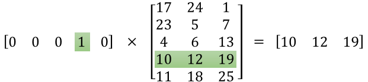
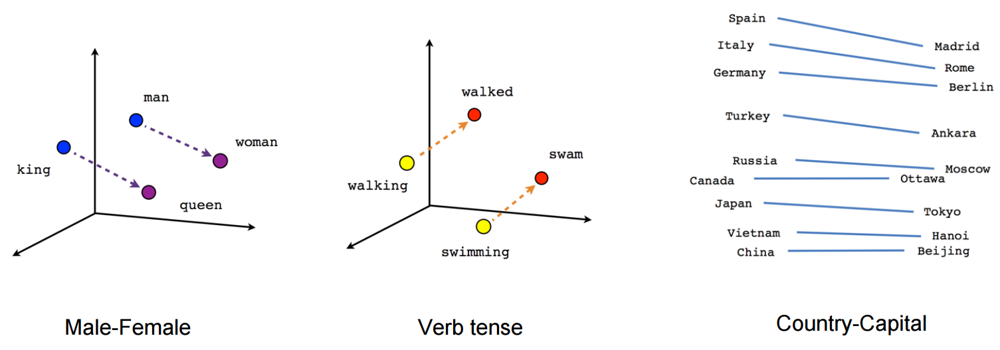

##### 본 글은 번역/의역글입니다. ([원본글은 링크 참고](https://medium.com/deeper-learning/glossary-of-deep-learning-word-embedding-f90c3cec34ca))

**Word Embedding의 핵심 내용은 텍스트를 숫자로 바꾸는 것입니다.**

많은 머신러닝 알고리즘이 Input값을 어떤 연속형의 벡터로 바꾸길 필요로 하기 때문에 이 작업은 중요합니다. 단순히 문자 나열식의 텍스트 정보로는 작동이 되지 않으니 말이죠.

그래서 Word Embedding과 같은 자연어 모델링은 단어나 구문을 해당하는 숫자형태의 벡터로 매핑하는 작업에 쓰입니다.

이 작업은 두 가지 중요한 장점을 가지고 있습니다.
>
### Dimensionality Reduction — 효율적 표현
### Contextual Similarity — 풍부한 표현

[Bag of words](https://en.wikipedia.org/wiki/Bag-of-words_model)에 익숙하다면, 결과값은 굉장히 큰 one-hot encoded vectors(각 document를 표현하는 벡터의 차원이 사용되는 단어(vocabulary)의 차원값)라는 것을 알 것입니다. Word Embedding은 그 보다 훨씬 적은 차수로 벡터를 만드는 것을 목표로 합니다. 이것을 Word Vectors라고 합니다.  

Word Vectors는 의미에 따른 문장 구문 분석에 쓰입니다. 텍스트에서 의미를 추출해내는 작업입니다. Language model이 텍스트의 의미를 예측하려면 단어들간의 맥락을 인지하고 있어야 합니다. 예를 들어, 우리는 문장안에서 재배되고(are grown), 수확되고(are picekd), 먹고(eaten), 즙을 짜내는(juiced) 단어를 보게 된다면 사과나 오렌지 같은 과일 단어를 떠올리게 되지만, '비행기'와 같은 단어를 떠올리지는 않을 것입니다.

Word Embedding에서 만들어지는 벡터는 이러한 유사성을 유지하므로 텍스트에서 규칙적으로 발생하는 단어는 벡터 공간에서도 근접하게 나타납니다. 이것이 유용한 이유에 대한 예시는 [THe amazing power of vectors](https://blog.acolyer.org/2016/04/21/the-amazing-power-of-word-vectors/)나 Kaggle의 [Distributed Word Vectors](https://www.kaggle.com/c/word2vec-nlp-tutorial)를 확인해보시길 바랍니다.

 
## "Word embedding이 무엇인가요?"에 대한 대답은:
**단어의 문맥 유사성을 유지하는 단어 뭉치에서 저차원(low-dimensional) 벡터를 만드는 것입니다.**

 
## Introducing Word2Vec

이제 무엇인지는 알았으니, 어떻게 작동하는 것일까요? Dimensionality reduction을 알기 전에는 일반적으로 비지도 학습 알고리즘을 이용하였습니다. 이 접근 방법이 그 유명한 word2vec입니다.

Word2vec을 구현하기 위해선 2가지 방법이 있습니다: **CBOW (Continuous Bag-Of-Words) and Skip-gram.**

**CBOW** 에서는 타겟이 되는 단어 근처에 윈도우(window)를 만들어, 그 단어를 네트워크의 input으로 넣어 타겟 단어를 예측합니다.
**Skip-gram** 은 바로 이 반대입니다. 타겟 단어가 있고, 타겟 단어 근처 윈도우에 해당하는 단어를 예측하는 것이 Skip-gram이 하는 일입니다.

Input단어는 one-hot encoded vectors로 바뀌어지게 됩니다. 그리고 이 벡터들은 hidden layer에 들어가게 되고, 최종 예측을 위해 softmax layer를 거치게 됩니다. 중점은 가중치 matrix를 결정하는 hidden layer를 좋은 결과물이 나올 수 있도록 잘 훈련시키는 일입니다. 이 가중치 matrix는 embedding matrix라고도 불리는데, look-up table로 이해하면 좋을 것 같습니다.

Xin Rong은 word embeddings가 어떻게 훈련되고 좋은 결과를 내는지 보여주는 [visual demo](https://ronxin.github.io/wevi/)를 만들었습니다.

Embedding matrix는 단어 수(행))와 hidden layer의 뉴런수(즉 embed size)(열)로 이루어져있습니다. 10,000개의 단어와 300 hidden units이 있다면, matrix의 사이즈는 10,000x300일 것입니다. 계산이 끝나면, word vector는 결과 matrix에서 0 또는 1 검색을 통해 얻어지게 됩니다:

따라서 각 단어에는 연관된 vector가 있고 이를 word2vec이라고 합니다.

Hidden layer의 사이즈이기도 하고, 단어간의 유사성을 나타내는 feature의 수인 embed size는 단어의 실제 갯수보다는 훨씬 적습니다. embed size는 trade-off입니다. 더 많은 수의 feature는 더 긴 연산 시간을 요구하지만 더 좋을 수도 있는 모델을 만듭니다.

**Word embedding의 흥미로운 특징은 단어간의 문맥상 유사성을 숫자로 표현하기 때문에 산술적으로 조작이 가능합니다. 고전적인 예는 "남자"에서 "왕"이라는 개념을 빼고 "여자"라는 개념을 넣는 것입니다. 당신의 training set에 따라 결과는 다를 수 있겠지만, 결과는 "여왕"이 등장할 것입니다. 이유가 궁금하다면 이 [포스트](http://p.migdal.pl/2017/01/06/king-man-woman-queen-why.html)를 참고하세요.**

Word Embeddings는 문맥상의 유사성입니다. 이는 성별, 시제, 지리 등 수없이 많은 문맥이 있겠죠. 위의 선들은 수학적 vector를 뜻합니다. embeddig space에서 Man에서 Queen으로 움직이기 위해서는 King을 빼고 Woman을 넣어야 한다는 것을 볼 수 있습니다.

Word embedding으로 알려져 있는 또 다른 알고리즘은 GloVe인데, 이는 단어의 공동발생(co-occurrences) 누적 결과로 작동합니다. ([How is GloVe different from word2vec?](https://www.quora.com/How-is-GloVe-different-from-word2vec)를 참고하세요.)

그렇다면 딥러닝은 어느 부분에서 작동하는 것일까요?

Word2vec은 two-layer neural net으로 구성되어 있으니, 이 자체로는 딥러닝이라 할 수 없습니다.([참고링크](https://www.quora.com/Can-word2vec-be-considered-deep-learning))하지만 Word2vec, GloVe같은 기술은 텍스트 정보를 숫자화시켜 이를 deep nets에 활용할 수 있습니다.[Recurrent Neural Networks with Word Embeddings](http://deeplearning.net/tutorial/rnnslu.html)이 그 예시입니다.

 
### 요약하자면 word embedding의 목적은 단어를 숫자형태로 바꾸는 것입니다. 그리곤 딥러닝과 같은 알고리즘이 이를 input으로 받아들이고 작동하게 됩니다.
### Word Embedding은 숫자로 만들어진 단어입니다.
