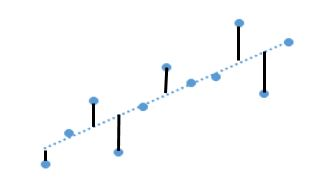
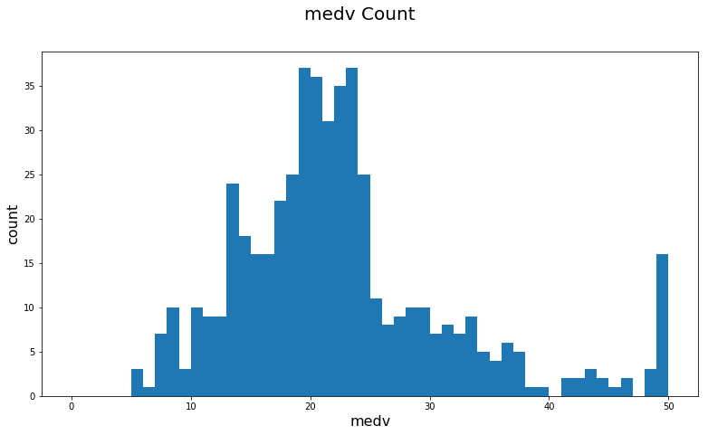
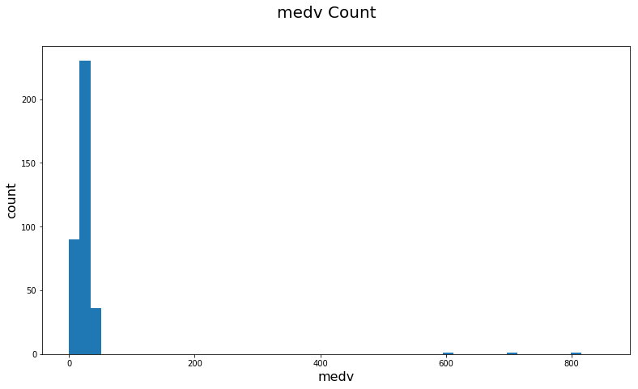

Regression문제에서 쓰이는 대표적 Loss function인 L1 loss function과 L2 loss function을 알아보도록 하겠습니다.
생소한 단어이기에 처음에는 헷갈리실 수 있지만, 이 개념은 어렸을 적 1차 방정식, 2차 방정식 문제를 풀 때 이미 접하였던 내용입니다.

<br />
## 0. Loss Function 이란?
Loss Function은 당신이 만든 모델의 예측 값이 실제 값들과 얼마나 유사한지 평가하는 방법입니다. 데이터 셋 안에서의 예측 값(predicted values)이 실제 정답(actual values)과 다르면 다를수록 loss function의 결과값은 커질것이고, 예측 값이 실제 정답과 유사하면 유사할수록 loss function의 결과는 작아지게 됩니다.
다시 말해, **오차를 측정하는 일이 loss function의 role입니다.**

<br />
**오차를 어떠한 방법으로 측정할 것인가?**에 따라 방법론이 나뉘게 되는데 그 중 Regression 문제에 대한 대표 방법론이 **1) L1 loss function**, **2) L2 loss function** 입니다.

<br />
## 1. L1 Loss Function
아래 그림을 보겠습니다.

동그란 점이 실제 값이고, 점선이 예측 모델의 결과 값이라 하였을 때, 당신의 모델이 얼마나 정확한지 평가하기 위해서는 어떤 방법이 있을까요?
얼마나 틀렸는지 정도를 확인하기 위해, 실제 값과 예측 값의 차이, 즉 difference의 합(summation)이 있습니다.

물론 (예측 값-실제 값)은 양의 값, 음의 값 모두 가능하기 때문에 이들의 차이를 구하기 위해서는 단순한 summation이 아닌 절대값(absolute value)을 씌운 후 summation을 하는 법이 적합하겠죠.

>y_1 = 0 이고 f(x_1) = 5일때 두 점의 차는 5가 됩니다. 마찬가지로,
y_2 = 0 이고 f(x_2) = -5일때 두 점의 차는 -5가 됩니다. 오차에 대하여 단순 summation을 한다면 값은 0이 나와, 당신의 모델은 틀린 것이 없는 모델로 판별나게 됩니다. 하지만 이는 사실이 아니죠? 따라서 두 오차에 대해 각각 절대값을 씌우게 된다면 y_1 - f(x_1)의 차이는 5이며, y_2 - f(x_2)의 차이도 5가 되어 최종 loss function의 결과값은 10이 나오게 됩니다.

**이것이 L1 Loss Function입니다.**
이를 수식으로 나타내면 아래와 같습니다.

<br />


<br />
결국 **오차의 정도(magnitude without direction)**를 나타내는 값이 되게 됩니다.


## 2. L2 Loss Function
오차의 absolute value의 summation 외의 다른 오차의 합을 구하는 방법은 무엇이 있을까요?
absolute value 대신 **제곱(squared)을 취하는 것입니다.**

**이것이 L2 Loss Function입니다.**
수식은 아래와 같습니다.

<br />


<br />
오차의 제곱을 취하면서 L2 Loss function은 **2차 방정식 형태가 됩니다. 그리고 2차 방정식은 U자의 포물선 형태의 방정식이기 때문에 오차의 방향성도 알 수 있습니다.**

<br />
## 3. L1 Loss function vs. L2 Loss Function
이 둘의 차이점은 무엇일까요?
수식에서 눈치를 채셨을 수 있겠지만, **L2 Loss function이 L1 대비 outlier에 더 큰 반응을 하게 됩니다.**

정말 그러한지, 아래 예시 데이터를 통해 보여드리겠습니다.(Sample Dataset은 Kaggle의 Boston Housing Dataset을 활용하였습니다.)

### 분석과정
>1) Gradient Boosting을 이용하여 y를 예측하는 모델을 만들고 결과값을 각각 L1 loss function과 L2 loss function을 이용하여 비교합니다.
<br />
2) 같은 데이터셋에 Outlier를 임의로 생성하고 기존 Dataset에 추가하였습니다.
<br />
3) 2)에서의 새로운 Dataset으로 y를 예측하는 모델을 만들고 1)과 같이 L1 loss function과 L2 loss function의 결과값을 1)의 내용과 비교합니다.
<br />
4) 우리의 가정이 맞다면, L1 loss function의 결과값 변화가 L2 loss function 결과값 변화 대비 무디게 나타나야 할 것입니다. (L2 loss function이 outlier에 더 크게 반응하기 때문이죠.)


```python
import numpy as np
import pandas as pd
from sklearn.model_selection import train_test_split
from sklearn.ensemble import GradientBoostingRegressor
from statsmodels.tools.eval_measures import rmse
import matplotlib.pylab as plt
```


```python
# Read Housing Dataset
data = pd.read_csv('../sample_data/housingdata.csv')
```


```python
# See how the data looks like
data.describe()
```


<div>
<style>
    .dataframe thead tr:only-child th {
        text-align: right;
    }

    .dataframe thead th {
        text-align: left;
    }

    .dataframe tbody tr th {
        vertical-align: top;
    }
</style>
<table border="1" class="dataframe">
  <thead>
    <tr style="text-align: right;">
      <th></th>
      <th>crim</th>
      <th>zn</th>
      <th>indus</th>
      <th>chas</th>
      <th>nox</th>
      <th>rm</th>
      <th>age</th>
      <th>dis</th>
      <th>rad</th>
      <th>tax</th>
      <th>ptratio</th>
      <th>b</th>
      <th>lstat</th>
      <th>medv</th>
    </tr>
  </thead>
  <tbody>
    <tr>
      <th>count</th>
      <td>506.000000</td>
      <td>506.000000</td>
      <td>506.000000</td>
      <td>506.000000</td>
      <td>506.000000</td>
      <td>506.000000</td>
      <td>506.000000</td>
      <td>506.000000</td>
      <td>506.000000</td>
      <td>506.000000</td>
      <td>506.000000</td>
      <td>506.000000</td>
      <td>506.000000</td>
      <td>506.000000</td>
    </tr>
    <tr>
      <th>mean</th>
      <td>3.613524</td>
      <td>11.363636</td>
      <td>11.136779</td>
      <td>0.069170</td>
      <td>0.554695</td>
      <td>6.284634</td>
      <td>68.574901</td>
      <td>3.795043</td>
      <td>9.549407</td>
      <td>408.237154</td>
      <td>18.455534</td>
      <td>356.674032</td>
      <td>12.653063</td>
      <td>22.532806</td>
    </tr>
    <tr>
      <th>std</th>
      <td>8.601545</td>
      <td>23.322453</td>
      <td>6.860353</td>
      <td>0.253994</td>
      <td>0.115878</td>
      <td>0.702617</td>
      <td>28.148861</td>
      <td>2.105710</td>
      <td>8.707259</td>
      <td>168.537116</td>
      <td>2.164946</td>
      <td>91.294864</td>
      <td>7.141062</td>
      <td>9.197104</td>
    </tr>
    <tr>
      <th>min</th>
      <td>0.006320</td>
      <td>0.000000</td>
      <td>0.460000</td>
      <td>0.000000</td>
      <td>0.385000</td>
      <td>3.561000</td>
      <td>2.900000</td>
      <td>1.129600</td>
      <td>1.000000</td>
      <td>187.000000</td>
      <td>12.600000</td>
      <td>0.320000</td>
      <td>1.730000</td>
      <td>5.000000</td>
    </tr>
    <tr>
      <th>25%</th>
      <td>0.082045</td>
      <td>0.000000</td>
      <td>5.190000</td>
      <td>0.000000</td>
      <td>0.449000</td>
      <td>5.885500</td>
      <td>45.025000</td>
      <td>2.100175</td>
      <td>4.000000</td>
      <td>279.000000</td>
      <td>17.400000</td>
      <td>375.377500</td>
      <td>6.950000</td>
      <td>17.025000</td>
    </tr>
    <tr>
      <th>50%</th>
      <td>0.256510</td>
      <td>0.000000</td>
      <td>9.690000</td>
      <td>0.000000</td>
      <td>0.538000</td>
      <td>6.208500</td>
      <td>77.500000</td>
      <td>3.207450</td>
      <td>5.000000</td>
      <td>330.000000</td>
      <td>19.050000</td>
      <td>391.440000</td>
      <td>11.360000</td>
      <td>21.200000</td>
    </tr>
    <tr>
      <th>75%</th>
      <td>3.677082</td>
      <td>12.500000</td>
      <td>18.100000</td>
      <td>0.000000</td>
      <td>0.624000</td>
      <td>6.623500</td>
      <td>94.075000</td>
      <td>5.188425</td>
      <td>24.000000</td>
      <td>666.000000</td>
      <td>20.200000</td>
      <td>396.225000</td>
      <td>16.955000</td>
      <td>25.000000</td>
    </tr>
    <tr>
      <th>max</th>
      <td>88.976200</td>
      <td>100.000000</td>
      <td>27.740000</td>
      <td>1.000000</td>
      <td>0.871000</td>
      <td>8.780000</td>
      <td>100.000000</td>
      <td>12.126500</td>
      <td>24.000000</td>
      <td>711.000000</td>
      <td>22.000000</td>
      <td>396.900000</td>
      <td>37.970000</td>
      <td>50.000000</td>
    </tr>
  </tbody>
</table>
</div>


```python
# Check the distribution of 'medv'(our y)
fig = plt.figure(figsize=(13,7))
plt.hist(data['medv'], bins=50, range = (0, 50))
fig.suptitle('medv Count', fontsize = 20)
plt.xlabel('medv', fontsize = 16)
plt.ylabel('count', fontsize = 16)
```





```python
# Create a data frame with all the independent features
x = data.drop('medv', axis = 1)

# Create a target vector(vector of dependent variable, i.e. 'medv')
y = data['medv']

# Split data into training and test sets
train_X, test_X, train_y, test_y = train_test_split(x, y,
                                                    test_size = 0.30,
                                                    random_state = None)
```


```python
# So let's fit a GradientBoostingRegressor with a L1(Least Absolute Deviation) loss function
np.random.seed(9876)

# A GradientBoostingRegressor with L1(Least Absolute Deviation) as the loss function
mod = GradientBoostingRegressor(loss='lad')

fit = mod.fit(train_X, train_y)
predict = fit.predict(test_X)

# Root Mean Squared Error
rmse(predict, test_y)
```


    3.5363012044993689


```python
# A GradientBoostingRegressor with L2(Least Squares) as the loss function
mod = GradientBoostingRegressor(loss='ls')

fit = mod.fit(train_X, train_y)
predict = fit.predict(test_X)

# Root Mean Squared Error
rmse(predict, test_y)
```


    2.9678600744557597


Outlier가 심하지 않은 데이터셋에서의 L1 loss function과 L2 loss function의 RMSE는 각각 3.5363, 2.9679로 나타납니다.
<br />

이제 기존 Dataset에 추가할 Outlier를 더 만들어보겠습니다.


```python
##Make more outliers
min_y = data.describe().loc[['min'],:].drop('medv', axis = 1)
max_y = data.describe().loc[['max'],:].drop('medv', axis = 1)
```


```python
np.random.seed(1234)

# Create 10 random values
rands = np.random.rand(5, 1)
rands

# Get the 'min' and 'max' rows as numpy array
min_array = np.array(min_y)
max_array = np.array(max_y)

# Find the difference(range) of 'max' and 'min'
_range = max_array - min_array

# Generate 5 samples with 'rands' value
outliers_X = (rands * _range) + min_array
# Change the type of 'chas', 'rad' and 'tax' to rounded of Integers
outliers_X[:, [3, 8, 9]] = np.int64(np.round(outliers_X[:, [3, 8, 9]]))
```


```python
# We will also create some hard coded outliers
# for 'medv', i.e. our target
medv_outliers = np.array([0, 0, 800, 700, 600])
medv_outliers
```


    array([  0,   0, 800, 700, 600])


```python
# Finally concatenate our existing 'train_X' and
# 'train_y' with these outliers
train_X = np.append(train_X, outliers_X, axis = 0)
train_y = np.append(train_y, medv_outliers, axis = 0)

# Plot a histogram of 'medv' in train_y
fig2 = plt.figure(figsize=(13,7))
plt.hist(train_y, bins=50, range = (0, 850))
fig2.suptitle('medv Count', fontsize = 20)
plt.xlabel('medv', fontsize = 16)
plt.ylabel('count', fontsize = 16)
```





```python
# GradientBoostingRegressor with L1 loss function
np.random.seed(9876)

mod = GradientBoostingRegressor(loss='lad')

fit = mod.fit(train_X, train_y)
predict = fit.predict(test_X)

# Root Mean Squared Error
rmse(predict, test_y)
```


    4.9849993118102951


```python
# GradientBoostingRegressor with L2 loss function
mod = GradientBoostingRegressor(loss='ls')

fit = mod.fit(train_X, train_y)
predict = fit.predict(test_X)

# Root Mean Squared Error
rmse(predict, test_y)
```


    9.0276645133850373


Outlier가 더 추가된 데이터셋에서의 L1 loss function과 L2 loss function의 RMSE는 각각 4.9850, 9.0277로 나타납니다.

| Type of Dataset | L1    | L2    |
|:---------------:|:-----:|:-----:|
|  Less Outliers  | 3.5363| 2.9679|
|  More Outliers  | 4.9850| 9.0277|


우리의 예상처럼 L1 loss function의 결과값 변화가 L2 loss function 결과값 변화 대비 무디게 나타납니다.

<br />
따라서 **훈련시키는 Dataset의 Outlier가 별로 없다거나 무시할 수 있는 데이터라면 L1 Loss function을 써도 무방하고, 그렇지 않은 경우라면 L2 Loss function을 쓰면 됩니다.**
