통계나 데이터를 다루는 공부를 하다보면 standardization, normalization, regularization이라는 단어를 많이 보게 됩니다. 이 단어들은 이전 포스트에서도 등장했지만 앞으로의 글에도 계속 쓰게될 단어고 그만큼 중요합니다. 하지만, -ization으로 끝나서인지는 몰라도 이 세 단어의 개념을 확실하게 구분 짓지 못하는 경우가 많습니다. 혼용해서 쓰는 경우도 있고요.
오늘은 이 차이점에 대해서 적어보겠습니다.

우선은 쓰이는 용도로 구분을 한다면 **1) standardization, 2) normalization은 데이터 값을 adjusting하고, 3) regularization은 당신이 만들 예측 함수를 adjusting** 합니다. 이 작업은 모두 효율적인 데이터 처리, 좋은 모델을 만들기 위한 작업이라 할 수 있습니다.
3) regularization은 설명드릴 이야기가 다소 많은 관계로 오늘은 데이터 adjust용인 standardization과 normalization만을 다루겠습니다.

<br />
## Why do we have to adjust the data
소득(y)을 예측하기 위해 선형회귀모형을 만드려고 합니다. x_1~x_10의 열 개의 변수가 종속 변수이며, 이 중 x_1은 '학점'이라는 변수로 range는 0부터 4.5입니다. 그리고 x_10이라는 변수는 '직장동료의평균연소득'이라고 한다면 range는 0에서부터 억단위의 숫자도 존재할 수 있겠죠.

회귀모형은 y = b_1 * x_1 + b_2 * x_2 + ... + b_10 * x_10, 와 같은 형태의 식이 만들어질 것입니다.

**1) 서로 다른 스케일을 가진 x1과 x2가 각각 1 unit씩 움직였을 때 y에게 얼만큼의 영향을 주는 지 비교할 수 있습니다.**
<br />
'학점'이라는 변수가 1만큼 움직이게 되면 변화되는 y의 값과, '직장동료의평균연소득'이라는 변수가 1만큼 움직이게 되면 변화되는 y의 값은 당연히 다를 것입니다. 둘은 다른 스케일을 가지고 있기 때문이죠. x가 변화됨에 따라 y가 어떻게 변화되는지 한눈에 보고 싶다면 두 변수 모두 standardize 혹은 normalize시키면 됩니다.

**2) 모델 학습 시, 변수의 Scale에 덜 민감합니다.**
<br />
모델을 학습 시킨다면 '소득'(y)에 대해 '학점'(x_1),'직장동료의평균연소득'(x_10)의 계수 b_1, b_10이 추정될 것입니다.
변수의 scale이 다르니 당연히 b_1이 0.1만큼 움직이는 경우와 b_10이 0.1만큼 움직임에 따른 y의 변화량도 다릅니다. x_10의 scale이 훨씬 크다보니 모델 학습 시, x_10의 계수를 추정하는데 더 많은 시간이 소요될 것입니다.

**3) ML에서의 Optimization에 효율적입니다.**
<br />
Gradient descent를 이용해 가장 최적의 optimal point로 수렴시키는 것이 Machine Learning Modeling의 궁극적인 목적인데, 변수를 scaling하지 않는다면 이 시간이 굉장히 오래 걸리거나 수렴이 되지 않는 경우가 많습니다.

'학점'과 '직장동료의평균연소득'와 같이 스케일이 다른 features의 weight를 그림으로 그려본다면 굉장히 긴 타원형 모양의 형태일 것입니다. 우리는 이 weight를 수없이 많이 점검하면서 가장 optimal한 점에 도달하는 weight의 조합을 찾아내야 합니다.

이해를 도울 수 있는 Geoffrey Hinton교수의 강의 내용입니다.  
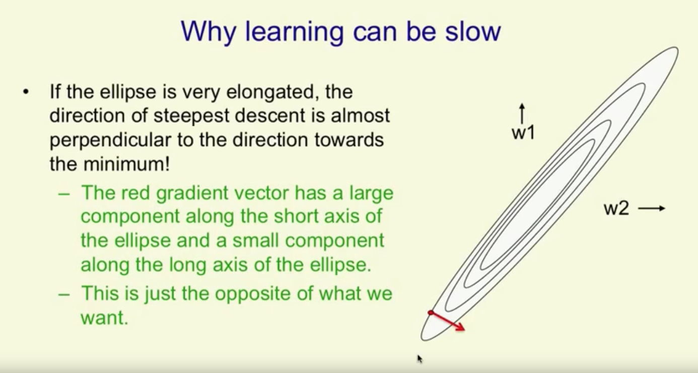

우리가 궁극적으로 원하는 바는 optimal point에 도달하는 것이므로 왼쪽으로 더 많이 움직이고 아래로는 조금만 움직여야 합니다. 하지만 steepest descent를 따라간다면 주황색 점에서 수직으로 내려가게 되고 매 학습시 움직이는 점의 위치는 위/아래로 더 많이 움직이고, 왼쪽으로는 아주 조금씩 움직이게 될 것입니다.

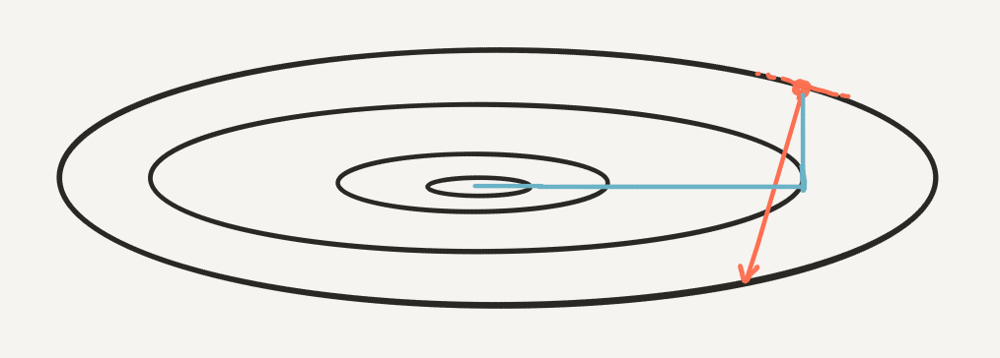

이는 convergence 속도를 굉장히 느리게 만들 것입니다.
<br />
Standardization/Normalization의 수식과 실제 데이터를 통한 예시를 보겠습니다.

<br />
# 1. Standardization

Standardization의 수식은 다음과 같습니다.

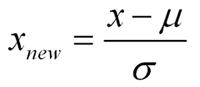

Standardization은 넓게 흩어져 있는 데이터를 mean은 0, variance는 1로 transform합니다.
예시와 함께 보겠습니다.


```python
import numpy as np
import pandas as pd
from sklearn import preprocessing
import matplotlib.pylab as plt
%matplotlib inline
```


```python
#import sample data
data = pd.read_csv('../sample_data/housingdata.csv')
```


```python
#find the variables for the example
data.describe()
```


<div>
<style>
    .dataframe thead tr:only-child th {
        text-align: right;
    }

    .dataframe thead th {
        text-align: left;
    }

    .dataframe tbody tr th {
        vertical-align: top;
    }
</style>
<table border="1" class="dataframe">
  <thead>
    <tr style="text-align: right;">
      <th></th>
      <th>crim</th>
      <th>zn</th>
      <th>indus</th>
      <th>chas</th>
      <th>nox</th>
      <th>rm</th>
      <th>age</th>
      <th>dis</th>
      <th>rad</th>
      <th>tax</th>
      <th>ptratio</th>
      <th>b</th>
      <th>lstat</th>
      <th>medv</th>
    </tr>
  </thead>
  <tbody>
    <tr>
      <th>count</th>
      <td>506.000000</td>
      <td>506.000000</td>
      <td>506.000000</td>
      <td>506.000000</td>
      <td>506.000000</td>
      <td>506.000000</td>
      <td>506.000000</td>
      <td>506.000000</td>
      <td>506.000000</td>
      <td>506.000000</td>
      <td>506.000000</td>
      <td>506.000000</td>
      <td>506.000000</td>
      <td>506.000000</td>
    </tr>
    <tr>
      <th>mean</th>
      <td>3.613524</td>
      <td>11.363636</td>
      <td>11.136779</td>
      <td>0.069170</td>
      <td>0.554695</td>
      <td>6.284634</td>
      <td>68.574901</td>
      <td>3.795043</td>
      <td>9.549407</td>
      <td>408.237154</td>
      <td>18.455534</td>
      <td>356.674032</td>
      <td>12.653063</td>
      <td>22.532806</td>
    </tr>
    <tr>
      <th>std</th>
      <td>8.601545</td>
      <td>23.322453</td>
      <td>6.860353</td>
      <td>0.253994</td>
      <td>0.115878</td>
      <td>0.702617</td>
      <td>28.148861</td>
      <td>2.105710</td>
      <td>8.707259</td>
      <td>168.537116</td>
      <td>2.164946</td>
      <td>91.294864</td>
      <td>7.141062</td>
      <td>9.197104</td>
    </tr>
    <tr>
      <th>min</th>
      <td>0.006320</td>
      <td>0.000000</td>
      <td>0.460000</td>
      <td>0.000000</td>
      <td>0.385000</td>
      <td>3.561000</td>
      <td>2.900000</td>
      <td>1.129600</td>
      <td>1.000000</td>
      <td>187.000000</td>
      <td>12.600000</td>
      <td>0.320000</td>
      <td>1.730000</td>
      <td>5.000000</td>
    </tr>
    <tr>
      <th>25%</th>
      <td>0.082045</td>
      <td>0.000000</td>
      <td>5.190000</td>
      <td>0.000000</td>
      <td>0.449000</td>
      <td>5.885500</td>
      <td>45.025000</td>
      <td>2.100175</td>
      <td>4.000000</td>
      <td>279.000000</td>
      <td>17.400000</td>
      <td>375.377500</td>
      <td>6.950000</td>
      <td>17.025000</td>
    </tr>
    <tr>
      <th>50%</th>
      <td>0.256510</td>
      <td>0.000000</td>
      <td>9.690000</td>
      <td>0.000000</td>
      <td>0.538000</td>
      <td>6.208500</td>
      <td>77.500000</td>
      <td>3.207450</td>
      <td>5.000000</td>
      <td>330.000000</td>
      <td>19.050000</td>
      <td>391.440000</td>
      <td>11.360000</td>
      <td>21.200000</td>
    </tr>
    <tr>
      <th>75%</th>
      <td>3.677082</td>
      <td>12.500000</td>
      <td>18.100000</td>
      <td>0.000000</td>
      <td>0.624000</td>
      <td>6.623500</td>
      <td>94.075000</td>
      <td>5.188425</td>
      <td>24.000000</td>
      <td>666.000000</td>
      <td>20.200000</td>
      <td>396.225000</td>
      <td>16.955000</td>
      <td>25.000000</td>
    </tr>
    <tr>
      <th>max</th>
      <td>88.976200</td>
      <td>100.000000</td>
      <td>27.740000</td>
      <td>1.000000</td>
      <td>0.871000</td>
      <td>8.780000</td>
      <td>100.000000</td>
      <td>12.126500</td>
      <td>24.000000</td>
      <td>711.000000</td>
      <td>22.000000</td>
      <td>396.900000</td>
      <td>37.970000</td>
      <td>50.000000</td>
    </tr>
  </tbody>
</table>
</div>


'nox'(range: 0.385~0.871)와 'tax'(range: 187~711)를 Scale이 다른 두 변수로 선택하고, 'medv'를 y로 하겠습니다.


```python
#scatterplot 'medv vs. nox'
plt.scatter(data['nox'], data['medv'], marker='o');
```


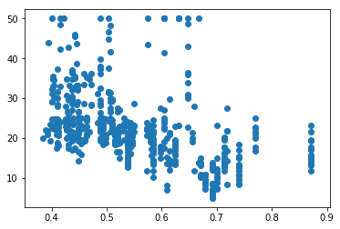


```python
#scatterplot 'medv' vs. 'tax'
plt.scatter(data['tax'], data['medv'], marker='o');
```


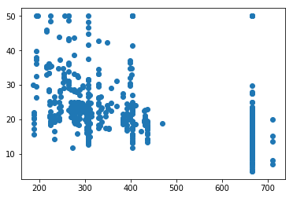

이제 두 개의 scatterplot을 하나의 그래프로 뿌려봅니다.


```python
plt.scatter(data['nox'], data['medv'], color='black', label='nox')
plt.scatter(data['tax'], data['medv'], color='red', label='tax')
plt.title("medv vs. two types of x variables")
plt.show()
```


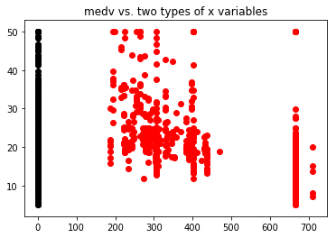


Scale이 다른 두 variables의 모습입니다. 안타깝게도, Scale이 상대적으로 큰 'tax'데이터로 인해 y가 두 변수에 어떻게 반응하는지 알 수 없습니다.

두 변수를 Standardize 해보겠습니다.
sklearn에서 Standardize는 StandardScaler(), Normalize는 MinMaxScaler()로 만들 수 있습니다.

### Standardize the column


```python
# get 'nox', 'tax'
x = data[['nox','tax']].values.astype(float)

# Create a minimum and maximum processor object
min_max_scaler = preprocessing.StandardScaler()

# Create an object to transform the data to fit minmax processor
x_scaled = min_max_scaler.fit_transform(x)

# Run the normalizer on the dataframe
df_standardized = pd.DataFrame(x_scaled)
```


```python
plt.scatter(df_standardized[0], data['medv'], marker='o');
```


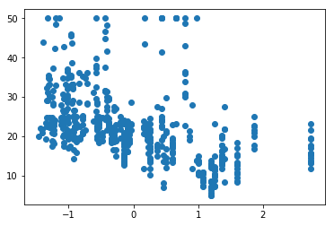


```python
plt.scatter(df_standardized[1], data['medv'], marker='o');
```


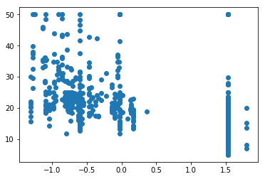


이제 두 개의 scatterplot을 하나의 그래프로 뿌려봅니다.


```python
plt.scatter(df_standardized[0], data['medv'], color='black', label='nox')
plt.scatter(df_standardized[1], data['medv'], color='red', label='tax')
plt.title("medv vs. two standardized x variables")
plt.show()
```


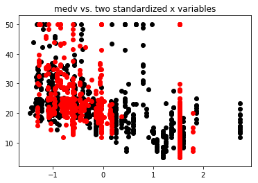


Scale이 달랐던 'nox'와 'tax'를 이제 함께 비교해볼 수 있습니다. Standardization은 mean = 0, variance =1의 값을 가지기 때문에 변환된 데이터의 range가 이에 맞게 변환된 것을 볼 수 있습니다.  

# 2. Normalization

Normalization 수식은 다음과 같습니다.

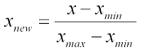

Normalization은 넓게 흩어져 있는 데이터의 range를 [0,1]사이의 값으로 변환시킵니다.  

좀 전에 보였던 데이터로 이번에는 normalization을 해보겠습니다.

### Normalize the column


```python
# Create x, where x the 'scores' column's values as floats
x = data[['nox','tax']].values.astype(float)

# Create a minimum and maximum processor object
min_max_scaler = preprocessing.MinMaxScaler()

# Create an object to transform the data to fit minmax processor
x_scaled = min_max_scaler.fit_transform(x)

# Run the normalizer on the dataframe
df_normalized = pd.DataFrame(x_scaled)
```


```python
plt.scatter(df_normalized[0], data['medv'], marker='o');
```


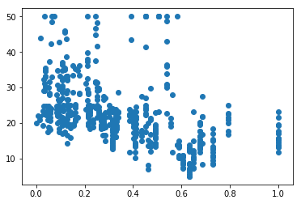


```python
plt.scatter(df_normalized[1], data['medv'], marker='o');
```


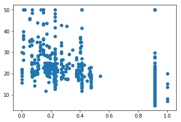


이제 두 개의 scatterplot을 하나의 그래프로 뿌려봅니다.


```python
plt.scatter(df_normalized[0], data['medv'], color='black', label='nox')
plt.scatter(df_normalized[1], data['medv'], color='red', label='tax')
plt.title("medv vs. two standardized x variables")
plt.show()
```


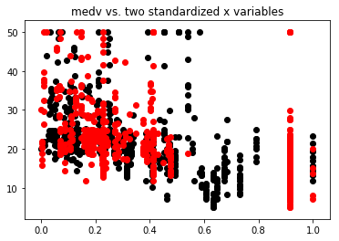


Normalization의 range는 [0,1]임을 확인할 수 있습니다.

**Standarization과 Normalization은 현업에서도 '숫자 놀이'를 할 때 자주 활용될 수 있습니다. 그런 경우, 저는 Normalization보다 Standardization을 주로 쓰는 편이지만, 어찌 됐든, 다양한 scale을 가진 데이터를 보유하고 있을 때 마주하는 hurdle을 이러한 transformation으로 해결하는 경우가 많으니 기억해두시는게 좋습니다.**
