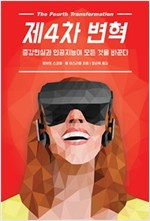

타이핑(typing), 클릭킹(clicking), 터칭(touching) 이후 새로운 -ing는 무엇이 될까?
<hr>

```
★★☆☆☆

친절한 클로이의 한줄평: 곧 다가올 가상현실, 증강현실의 미래를 잘 보여주었다.
까칠한 클로이의 한줄평: 흥미로운 콘텐츠이지만 내용을 너무 많이 담아서인지 지루하다는 함정  
```


## Chloe's Memo
- 이미 진행되고 있어 예상이 되는 부분도 있지만 게임, 엔터테인먼트 산업은 현재까지와 차원이 다른 무언가가 생겨나겠다.
- 새로운 형태의 엔터테인먼트
- 고개는 들고 손은 자유로워지고
- typing, clicking, touching 이후 새로운 -ing?
- **더 큰 변화는 <u>질문의 패러다임 쉬프트</u>**이다.
- 등장만 하면 거액의 투자를 받고 있는 가상현실/증강현실, 모빌리티(구체적으로는 자율주행). 나는 기술의 선구자가 되지는 못하겠고 떨어지는 콩고물이라도 챙기려면 무엇을 해야할까?
<br>
<br>
{: width="360" height="480"}
