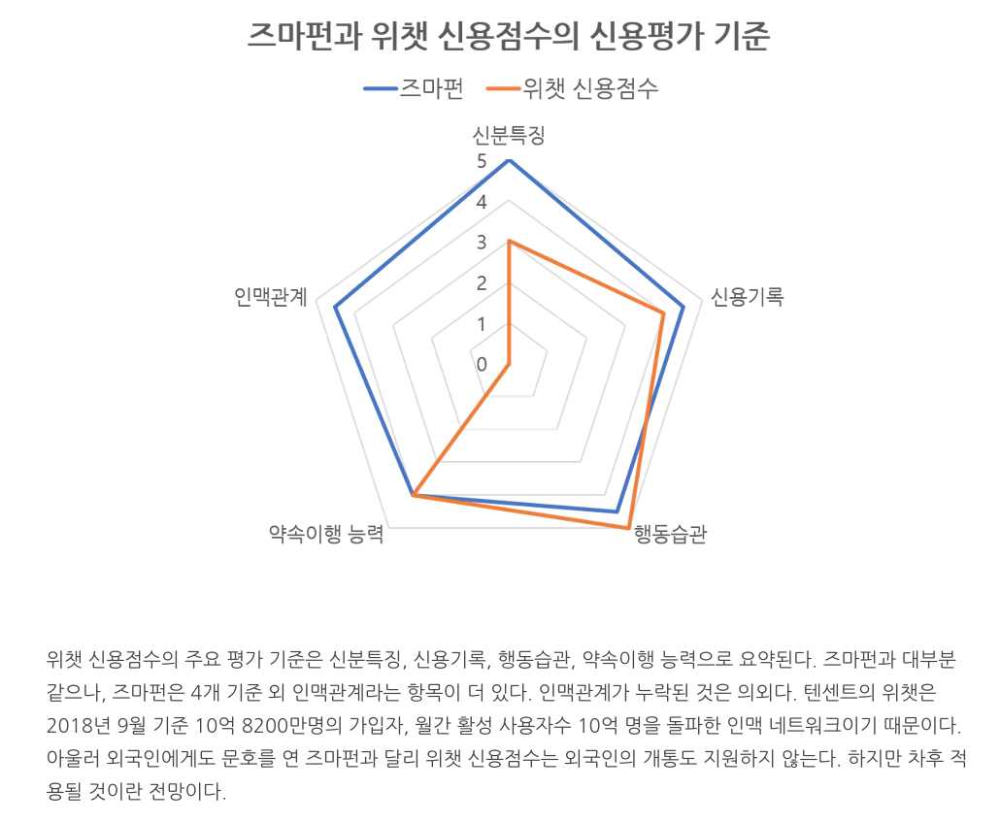

## 중국의 새로운 신용 평가
알리바바와 텐센트의 신용 등급을 통한 돈 빌려주기 시스템이다.
(관련링크: [알리바바-텐센트, 기술로 대륙의 신용을 만들다](https://platum.kr/archives/122809))

중국인들은 은행권 신용등급이 없는 사람이 굉장히 많다. 그들은 우리나라와 달리 신용카드 사용이 보편화되어 있지 않고 Pay가(알리페이와 같이) 그들의 주 결제 수단이다. 은행, 카드사에서의 여신 내역이 존재하지 않기 때문에 중국에서 돈 빌려주는 사람 입장에선 이 사람이 이자와 함께 빌려간 돈을 제대로 갚을 수 있지, 약속한 날짜는 잘 지킬 수 있을지 통 신뢰가 가지 않을 것이다. 그렇다고 해서 쓸 마음도 없는 대출이나 카드를 억지로 이용하라고 요구할 수도 없는 노릇이다.

아래는 위챗 신용점수의 주요 평가 기준이다.

 
평가 기준으로 생각해 본 변수는 다음과 같다.  
1) 신용기록: 페이 이용 내역  
2) 신분특징: 가입 시 입력한 신분 정보  
3) 인맥관계: 채팅 앱 내 친구 수, 실제로 이야기하고 지내는 활성화 친구 수 등  
4) 약속이행 능력: 친구와 나눈 대화를 통한 약속 이행 여부, 빌린 돈 제때 갚는지 여부 등  
5) 행동습관: 누군가에게 메시지가 오면 얼마만에 답장하는지, 주로 대화하는 사람이 누군지, 기상시간/취침시간 등  
 
물론 개인정보보호법 따위 무시하고, 모든 정보를 공유하고 있는 <u>중국</u>이라서 가능한 이야기일 수도 있지만
우리나라도 스멀스멀 이 비슷한 행동을 할 것이다. 왜? 누구든 돈은 벌고 싶어하고, 장사 중에서 돈 장사가 남는 장사니 말이다.

## 우리나라는 어떤 접근을 하고 있을까
중국과는 달리 우리나라는 문화적 이유로 기업이 개인을 **"평가"**함에 있어서 매우 조심스럽다. 섣불리 진행하다가는 오히려 Reputation risk에 지나치게 노출되고 수습하기에 바쁘다.

### _작성중_
