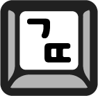

{: style="float: left; margin:5px 15px 5px 0;"}
"글 쓰는 또라이가 세상을 바꾼다!"라는 모임에 합류하였다. 3월부터 6개월 동안 2주 간격으로 글을 작성할 계획이다. 예치금을 두고 글을 작성하지 못하거나 팀원의 글에 피드백을 제공하지 못한다면 예치금이 차감되고, 6개월 동안 이 조건을 충족한다면 예치금을 돌려받는 시스템이다.

 
## 강제로라도 글을 써야겠다
2주에 글 1개가 말이야 쉽지 오히려 매일 있는 일정이 아녀서 습관으로 만들기엔 어렵다. 그리고 공교롭게도 `글또` 시작에 맞춰 직장을 옮기게 되어 개인 글을 쓸 수 있는 여유가 현저하게 줄어들 것으로 예상된다. 하지만 올해만큼은 글을 쓰는 데 강제성을 부여하고 싶다. 회사에서 업무를 문서화하는 일이나, 길을 걷다 떠오른 단상을 적는 일이나 모두 의미 있는 행위이다. 이번 글은 `글또`의 시작을 맞이하는 다짐 글이고, 우선은 나의 다짐을 적기에 앞서 왜 이 모임에 합류했는지 적어보겠다.

 
## 안정감을 찾기 위한 방향 설정
작년 11월 17일에 [만타라트 계획표](https://news.joins.com/article/19520959)를 작성했다. 내가 **2020년 11월까지 이루고자 하는 최종 목표는 `안정감`이다.** ~~(물론 안정감을 완전히 얻지는 못하겠지만 적어도 내가 무엇을 할 때 가장 안정감을 느끼는지 제대로 알고 앞으로의 또 다른 10년을 대비하는 한 해를 보내려 한다.)~~

**그간 무언가를 받아들이는데 시간을 할애했다. 세상에 일어나는 많은 일들이 그냥 지나칠만큼 사소하지도 않았고 온종일 생각해도 지겹지 않을 만큼 흥미로웠다. 그리고 혼돈 속에서 중요한 것과 중요하지 않은 것을 구분할 줄 알고, 어려운 상황을 직면하고 불편한 상황을 감내하는 훈련은 나에게 매우 값졌다. 관심 있던 일을 동경만 하는 것이 아닌, 바라는 바를 현실 세계로 끌어오는 법도 터득했다. 이 행동들의 근원은 내가 더 잘 할 수 있는 일이 무엇인지 찾고자 하는 의지에서 시작됐다. 이제 어느 정도 그 해답과 길이 보여 자연스레 `안정감`을 찾으러 도전하게 되었다.**

안정감을 얻고자 한다면 방향 설정이 중요하다. 그리고 가고자 하는 목적지 설정과 더불어 그때그때 제대로 된 방향 설정을 하기 위해서는 자신에게 충분한 시간을 할애해야 한다. 객관적으로 내가 해온 일, 하는 일을 되짚어 보고 아주 솔직하게 내가 무엇을 원하는지 자문자답해보는 시간을 가져야 할 것이다.

 
## 방향성을 찾기 위해 내가 하는 일
그때그때의 방향성을 잡기 위해 나는 주로 3가지를 한다. 그리고 이 일은 어떠한 이유에서든지 우선순위가 밀리지 않도록 확보한다.

### 1. 책 읽기  
**나는 책을 통해 미래를 바라본다거나 현재 나의 상태에 조언을 많이 얻는 편이다.** 그러다 보니 책을 읽지 않는 시간을 지속하면 내 안에 결핍되는 부분이 상당히 커져 다른 영역에도 좋지 않은 영향을 입는다. 책을 읽는 시간이 나에게는 쉼이고 여유를 부리는 행위라 책 읽는 시간은 어떻게든 확보하려 한다.

* **독서 모임을 다시 시작했다** 
**뇌가 피곤하거나, 마음이 심란할 때에는 소설이나 시를 읽지만, 인사이트는 주로 경제경영 서적에서 많이 얻는다. 책을 읽는 이유 중 하나는 다른 사람의 의견을 엿볼 수 있어서인데 이 관점에서 독서 모임은 꽤 큰 긍정적 영향을 준다.** 이번 독서 모임은 경영서적을 주제로 하고 `글또`처럼 여기도 예치금을 넣고, 참석+글 작성 여부에 따라 예치금이 차감되는 방식으로 진행된다. 앞으로 4월까지 읽게 될 책은 아래와 같다.
  1. 하드씽
  2. 업스타트
  3. 페이스북 이펙트
  4. 혁신기업의 딜레마
  5. 더골

~~아쉽게도 코로나바이러스 때문에 위 모임은 무기한 연기돼버렸다.:(~~

 
### 2. 운동하기   
얼핏 보면 운동이 방향성을 잡는 것과 무슨 연관이 있을까 싶지만, 운동해본 사람은 알 것이다. 운동하고 땀을 빼는 일이 우리한테 얼마나 큰 영향을 주는지. 꾸준히 운동할 때 정신도 건강해진다. 누구든 알겠지만 바쁠 때는 자리에서 잠시 일어날 틈도 없이 집중하게 되는데 매우 위험한 일이다. 의식적으로 몸을 움직이도록 해야 할 것이다.

* **1년 넘게 하고 있는 pt(personal training)** 
개인 운동을 제외하고 pt도 병행하고 있다. 일주일에 1~2회 정도 하고 있고, 개인 트레이너도 매우 성실하신 분이라 여러모로 나에게 도움이 된다. pt는 비용 부담이 있다고는 하지만 따지고 보면 큰 비용은 아니다. 생활 습관을 고치기 위해 '강습'이라는 수단을 사용하는 것이고, **운동하는 습관은 나에게 미래를 바라보고 하는 투자**와 같다. 가장 베스트는 이런 개인 트레이너 없이도 자발적으로 운동을 하는 것이겠지만 아쉽게도 아직 나에게 그런 의지는 없어서 억지로라도 움직일 수 있게 트레이닝을 받는 것이다.

 
### 3. 글쓰기  
일기, 감명받은 글귀 메모, 모든 글쓰기의 형태를 말한다. 글을 쓰면 누군가에게 이야기하는 기분이라 생각이 정리되고 다양한 이야기를 속 시원히 터놓을 수 있게 된다.

*  `글또` 4기 시작
* 감명 깊은 글귀 노트에 메모하기
* 짧은 글은 인스타, 트위터에 생각 저장해두기

 
## '글또' 모임 내 이루고자 하는 목표
습관을 만들어두면 나도 모르는 사이에 예상한 것을 넘어서 예상하지 못한 긍정적인 일들도 일어난다.
이번 6개월 동안의 one and only 목표는 **예치금 보존하기**이다. 우선은 시작이니 최소한의 목표를 세워 달성하도록 하겠다. 더불어 최대한 글 작성하기 편하게 블로그 구성을 바꿔보았다. 이전 블로그는 이래저래 커밋을 올리기 부담스럽게 카테고리를 짜와서 아무래도 바빠지다 보니 소홀해진 것 같다 판단되어서이다.
 
새로운 직장에 합류함과 동시에 글또를 시작해 어쩌면 다행(?)이라고 생각한다. 나의 도전을 응원하고 이번 다짐 글과 함께 2020년을 시작하는 초심을 기억하도록 하겠다.
