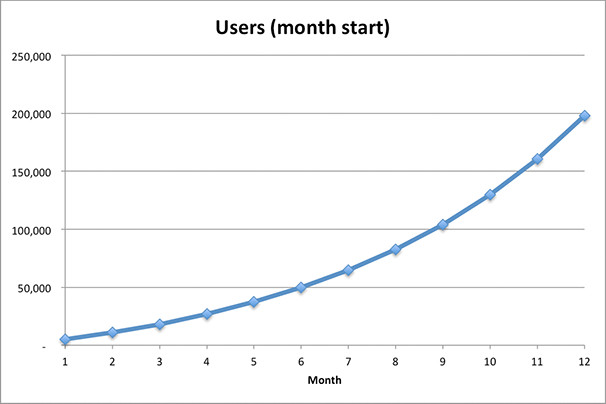

이 글은 Rahul Vohra의 [How to Model Viral Growth: The Hybrid Model](https://www.linkedin.com/pulse/20121002124206-18876785-how-to-model-viral-growth-the-hybrid-model/)의 번역본이며, 제가 얻은 경험을 바탕으로 본 글에 대해 이해한 바를 좀 더 추가하였습니다.

 
이 게시물은 viral growth를 어떻게 모델링하는지 보여주는 시리즈의 첫 번째 연재물이다. 우선은 가장 간단한 모델로 시작하고 동시에 non-viral 채널, 시간이 지남에 따라 어떻게 사용자를 얻는지, 그리고 사용자의 virality는 시간이 지남에 따라 어떻게 변화되는지에 대한 모델링도 진행하겠다. 소개하는 모델은 당신이 결과를 예상할 수 있게끔 도와주고 실제 데이터가 들어오게 된다면 그 데이터를 가지고 예측 툴을 만들 수 있도록 도와준다.
 
 

## Viral growth을 모델링하는 방법: 하이브리드 모델

### Viral Product란 무엇일까?
제품은 언론, 광고, 파트너십 등 다양한 채널을 통해 사용자를 확보한다. 아마도 가장 흥미로운 채널은 사용자 그들 스스로이다.

Viral product의 성장은 새로운 사용자를 데려올 수 있는 현재 사용자로부터 파생된다. 사용자는 다른 이들을 간단한 초대함으로써 우리 제품을 쓰게 할 수 있다. “이 제품 써봐. 재밌어!”와 같이 말이다. 또는 직접 제품을 사용하면서도 데려온다. “나는 페이팔을 통해 너에게 송금할 거야.”

**Virality의 가장 유명한 예 중 하나는 YouTube이다.** 지금처럼 영상의 거대한 종착역이 되기 이전에는 뉴스 사이트 또는 개인 블로그에 내장된 형태였었다. **당신이 만약에 그 영상을 보게 된다면 영상 가장 마지막에는 아는 사람들에게 동영상을 이메일로 보내도록 유도하고 당신의 사이트에 영상을 심을 수 있도록 코드를 부여한다. 만일 당신이 영상을 공유하지 않는다면 유튜브는 당신이 좋아할 만한 다른 영상을 제안하고 그럼 그중 하나를 당신은 공유하게 될 것이다. 그리고 당신이 공유한 영상을 본 다른 사람들은 그들이 아는 또 다른 누군가에게 영상을 공유하게 된다. 이런 패턴이 반복되면서 “viral loop”이 생기게 되었고 유튜브는 전례 없는 속도로 사용자를 확보했었다.**

우리의 viral 제품이 어떤 결과를 가져올지 어떻게 예측할 수 있을까? 1M 사용자를 확보하는 데 얼마나 걸릴까? 10M 사용자까지 갈 수 있을까? 100M 사용자까지도?

이와 같은 질문에 답하기 위해서는 **virality 모델** 을 만들어야 한다.

(이 Excel 스프레드시트를 따라 직접 실험해 보세요: [다운로드](../How to Model Viral Growth.xlsx))

 
### 가장 간단한 모델

5,000명의 사용자로 시작한다고 가정해 보겠다. 이 초기 사용자는 몇 명의 신규 사용자를 모집할 수 있을까?

글쎄, 일부 사용자는 우리의 제품을 좋아할 것이지만 누군가는 싫어할 것이다. 일부 사용자는 많은 사람을 초대하지만, 누구는 아무도 초대하지 않을 것이다. 일부 사용자는 하루 후에 사람들을 초대할 수 있지만 어떤 사용자는 일주일이 걸릴 수 있다.

이러한 모든 불확실성을 없애고 평균적으로 사용자 5명 중 1명이 첫 달에 새 사용자를 성공적으로 모집할 것이라고 가정해 보겠다. 즉, viral factor는 `1/5 = 0.2`이며 초기 5,000 명의 사용자가 첫 번째 월에 `5,000 * 0.2 = 1,000 명`의 사용자를 추가로 모집한다. 이 1,000명의 사용자는 두 번째 달에 `1,000명 * 0.2 = 200명`의 사용자를 추가로 모집하고 `200명 * 0.2 = 40명`의 사용자를 세 번째 달에 추가로 모집하게 된다. 그리고 이와 같은 방식으로 그다음 달들도 진행될 것이다.

사용자 성장은 어떤 모습일까? (첨부 엑셀 내 시트 “1.Simple” 참고)

감소한 속도로 사용자는 6250명에 수렴하게 된다.

만일 viral factor가 0.4였다면 어떨까?

또 다시 감소한 속도로 8300명쯤에 도달한다.

Viral factor가 `1.2`라면 어떻게 될까?

이번에는 사용자를 증가 속도로 얻을 수 있다!

사실 [쉬운 수학](https://en.wikipedia.org/wiki/Geometric_series#Formula)만으로 아래와 같은 사실을 얻을 수 있다.
**x 초기 사용자와 1 보다 작은 viral factor `v`로는 `x/(1-v)` 사용자에 도달할 때까지 감소 속도로 사용자를 얻을 수 있다.
1보다 큰 Viral factor로는 명백하게 우리는 계속 증가 속도로 사용자를 얻을 수 있다.**

굉장히 간단하다! 우리가 해야 할 일은 viral factor가 1이 넘어가게만 하면 되는 것이다!

하지만, 사실 그리 간단하지 않다.
첫째로 이 모델은 많은 부분이 잘못되어 있다. 예를 들어 점점 더 많은 사용자를 확보하면서 초대할 수 있는 새로운 사람들은 줄어들 것이다. 이 문제에 대해서는 더 깊게 들어가진 않겠지만 이 현상에 대해 더 알고 싶다면 [Andrew Chen의 글](https://andrewchen.co/facebook-viral-marketing-when-and-why-do-apps-jump-the-shark/)을 참고하면 되겠다.

둘째로 진정한 viral 성장은 매우 드물다. 이 사실을 받아들이는 데 나도 시간이 걸렸다. 아주 아주 소수의 제품만이 꽤 오랜 시간 동안 viral factor `1` 이상을 유지한다. `1` 이상의 viral factor 확보가 확실하지 않다면 우리는 모델에서 무엇을 이용해야 할까?

다른 사업가, 투자자, 그로쓰해커들과 논의해 본 결과 나는 다음과 같은 learning을 얻었다. Consumer internet product에서는 `0.15~0.25` 로 유지되는 viral factor는 좋은 편에 속하고, `0.4`는 훌륭하고, `0.7` 근처는 매우 탁월한 것이다.

그러나 앞서 viral factor가 1보다 작게 된다면 우리는 더 성장할 수 없을 때까지 감소된 속도로 사용자를 얻게 된다. 이 결과는 누구도 원치 않는다. 그럼 우리가 무엇을 놓치고 있는 것일까?
우리는 유저를 얻기 위한 다른 모든 채널을 빼먹고 있었다. press, app stores, direct traffic, inbound marketing, paid advertising, integration partnerships, cross-promotion partnerships, search engine marketing, search engine optimization, celebrity endorsement, street-corner hustling과 같이 우리가 생각해낼 수 있는 모든 채널 말이다. 이 점을 인지하고 우리의 모델을 다시 한번 살펴보자.

 
### Hybrid Model
Non-viral 채널을 포함하여 모델을 다시 만들어보겠다(엑셀 시트 “2.Hybrid”참고).

언론과 같은 어떤 non-viral 채널은 사용자 수에 있어 빠르게 spike를 보여주겠지만 앱스토어와 같은 어떤 채널은 꾸준히 일정한 유저를 불러들인다. 우리 모델은 이 두 가지 종류 모두를 포함하는 것으로 하고 단순하게 가기 위해 3개의 non-viral 채널을 고려하겠다.
1. 언론 이용: 70,000명의 신규 유저를 얻을 수도 있다
2. 앱스토어 검색 트래픽: 앱스토어에서는 한 달 40,000 다운로드를 기록할 수 있다. 다운받은 모든 유저가 앱을 실행하는 것도 아니고 앱을 실행한다 해도 모두가 가입 프로세스를 거치고 좋은 첫 유저 경험을 얻지 못할 수 있다. 따라서 60%만이 좋은 첫 유저 경험을 가졌다고 가정해보자.
3. 직접적 트래픽: 우리의 고객과 잠재적 고객은 알리기를 좋아하니 다른 사람들이 우리 제품을 바로 찾을 수 있다. 이는 한 달 10,000 다운로드를 불러들인다. 하지만 마찬가지로 60%의 다운로더만이 좋은 경험을 했다고 가정해보자.

마지막으로 위 세 가지 작용들이 시간에 지나도 그대로 유지된다고 가정하자.

Viral factor를 `0`으로 세팅하고 우리 제품이 viral을 전혀 타지 않으면 어떻게 되는지 보자.

연말이 되었을 때 우리는 450,000의 유저를 얻게 된다. 이제 viral 케이스를 실험해보자.

Viral factor `0.2`와 같은 좋은 경우 연말이 되면 우리는 550,000명의 유저를 얻을 수 있다. Viral factor가 `0.4`의 경우 연말에는 700,000의 유저를 얻을 수 있다. Viral factor `0.7`의 경우 연말 우리는 1.2M 사용자를 얻을 수 있다.

 
### The Amplification Factor
내 생각에 virality는 이러하다. Viral factor v가 아닌 amplification factor `a = 1/(1-v)`를 말하고자 한다. 전체 유저를 계산하기 위해 해야 할 일은 non-viral 채널을 통해 얻은 유저수를 amplification factor와 곱하는 것이다.

원문을 한 번 더 풀어 설명하자면, **geometric series(`a/(1-r)`)를 이용하여 amplification factor를 구한 것이다. 신규 유저들의 집합은 결국 `1/(1-v)` 만큼 증가하는 것이다. v 가 1이 넘지 않는다고 하더라도 제품에서 referral program이 있다면 우리가 가지고 있는 모든 채널에 amplification factor가 적용** 되는 것이다.

이 그래프는 viral factor < 1 이더라도 이것이 가진 굉장한 잠재력을 보여준다. Viral factor가 증가하게 되면 amplification factor는 지수함수로 증가하는 것이다. (pro tip: 다른 기업가들을 낚시질하기 위해서 [hyperbolic growth](https://en.wikipedia.org/wiki/Hyperbolic_growth)를 달성했다고 이야기해 보아라.)

 
### 요약
- 진정한 viral 성장은 매우 희귀하다. Consumer internet product에서는 `0.15~0.25` 로 유지되는 viral factor는 좋은 편에 속하고, `0.4`는 훌륭하고, `0.7` 근처는 매우 탁월한 것이다.
- Viral factor가 1보다 작다면 amplification factor 는  `a = 1/(1-v)`로 해석할 수 있다. 전체 유저를 계산하기 위해 해야 할 일은 non-viral 채널을 통해 얻은 유저 수를 amplification factor와 곱하는 것이다
- Viral factor가 1보다 작다면, 유지 가능하고 탄탄한 non-viral 채널을 확보하는 것이 핵심이다.
- Viral factor의 작은 증가가 amplification factor의 큰 증가로 이어진다.

 
원문의 글은 여기서 끝이 났는데, **결국 viral factor를 아주 조금씩이라도 증가시키기만 한다면 amplification은 훨씬 더 큰 폭으로 증가하게 된다라는 결론이다.** 이 `viral factor`는 위의 정의에서는 `기존 사용자가 데려온 신규 유저 수`/`기존 사용자 수`로 구하게 되는데, `기존 사용자가 데려온 신규 유저 수` 와 `기존 사용자 수` 는 **제품 생성자인 우리가 control할 수 있는 부분이 아니다. 따라서 이를 생성자인 우리 입장에서 또 다르게 표현해보자면 `v = 초대를 보낸 유저수 * 회원가입율(conversion rate)` 일 것이다.** 따라서 둘 중 하나, 또는 둘 다의 값을 올릴 수 있는 방법을 찾는다면 성장곡선은 아주 크게 증가할 것이다. 이를 이루기 위해서는 referral funnel에 대한 가설과 많은 실험 등을 통해서 얻어지게 된다.
* 고객들이 초대 링크를 잘 찾아내고 있는가?
* 링크를 공유하는데 큰 문제 없이 진행이 되는가?
* 공유를 받는 사람으로 하여금 거부감 없는 메시지를 전달하고 있는가?
* 가입자나 초대자들이 우리가 계획한 목적을 달성할 시 reward를 받는 순간을 어떻게 하면 더 편하게 만들 수 있을까?
