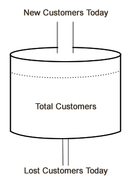

이 글은 Keith Schacht의 [Web and Mobile Products: Understanding your customers](https://medium.com/@keithie/web-and-mobile-products-understanding-your-customers-d8ee1e56b5a3)의 번역본이며, 제가 얻은 경험을 바탕으로 본 글에 대해 이해한 바를 좀 더 추가하였습니다. 당신의 제품에서 가질 수 있는 유저를 예측하는 carrying capacity에 대한 글 1편입니다. 

 
최근 몇 년간은 스타트업의 수치에 대한 좋은 그들이 많았습니다. 특별히 [Dave McCluers의 수치](https://www.slideshare.net/dmc500hats/startup-metrics-for-pirates-long-version)와 [Andrew Chens의 유저 획득에 관한 글](http://web.archive.org/web/20150425115223/http://andrewchenblog.com/list-of-essays#viral), [전환(conversion)에 대한 KissMetrics 자료 글](http://web.archive.org/web/20141209051356/https://blog.kissmetrics.com/conversions-vs-traffic/)이 있습니다. 최근  몇 개의 제품에 나는 이 핵심 모델을 적용해보고 복합적으로 활용해 보았는데 굉장히 유의미한 결과를 얻을 수 있었습니다. 이 방법론을 이끌 수 있었던 질문들은 아래와 같습니다. 
1. Power 유저들 모두가 어떠한 액션을 취했다(예를 들어 프로필 정보를 채웠다는 등)는 사실을 발견했다. 그래서 다른 유저들에게도 프로필 정보를 채우게 유도함으로써 당신의 제품에 더 빠져들게 만들려고 한다. 이 가정은 정말로 도움이 될까?
2. 24시간의 가동 중지 시간이 있었고, 다음 날 다시 트래픽을 가동할 수 있었다. 이것은 당신이 걱정해야 할 장기적인 영향을 미칠 것인가?
3. 하루에 100k 고유 유저를 가지고 있고 당신의 경쟁사들도 마찬가지이다. 하지만 매일 돌아오는 100k 유저가 더 중요한 것일까요? 아니면 일주일에 한 번씩 오는 700k 유저가 더 중요할까요? 이 사실이 중요할까요?
4. 새로운 광고 캠페인을 켜고 하루에 고유 방문자의 숫자가 증가하기 시작하는 것을 봅니다. 이 광고를 계속 키는 한 당신의 방문자 숫자는 계속 증가할 것이라 가정하겠죠? 
5. 이메일 도달 문제(아니면 Facebook이 알림 기능을 껐다는 가정)를 겪고 있어 당신 사이트에서의 유저의 새로운 활동을 알 수 없습니다. 고유 방문자는 살짝 떨어지고 있지만, 당신은 크게 걱정하고 있지 않습니다. 이게 맞을까요?  

 
다음은 제품의 고객을 분석하는 방법에 대한 자세한 how-to의 과정입니다. 
 
가장 중요한 통찰력은 바로 이것입니다. 가장 중요한 것은 **당신의 고유 고객은 얼마나 되는지 아는 사실과 암시적으로 무슨 이유로 이 숫자의 변화가 생겼는지 알아야** 합니다. 여기에서 고객은 방문자나 pageview를 이야기하는 것이 아니라, 장기적으로 반복될 수 있는 사람을 말합니다. 이러한 고객을 어떻게 측정할 수 있을지 아는 것은 당신의 PV, 방문자, 전환 funnel, 리텐션% 과 같이 수집하고 있는 숫자이면서도 왜 그러는지 알지 못하는 모든 숫자와 연결될 수 있습니다. 이것이 당신 제품의 심장이자 사업의 성공을 이끌 방법입니다.  
여기 간단한 모델이 있습니다.  
 
**첫 번째 단계는 매일 얼마만큼의 새로운 고객이 들어오는지 알아야 하고 이것을 알기 위해서는 무엇이 고객을 만든 지 정의해야 합니다.**  
사람들은 당신의 제품을 처음 보고 처음 밟는 스텝들을 거쳐 갈 것입니다. 그리고 당신의 제품을 쓰게 됩니다. (랜딩페이지에 도달하고, 가입하고, 친구들을 초대하는 일 등). 사람들은 일반적으로 이 일련의 단계를 새 사용자 유입경로라고 부르며, 깔때기의 끝은 일반적으로 사진을 업로드하거나 게임의 첫 번째 단계와 같이, 제품에 대한 핵심 작업인 완료와 같은 단계를 거치게 됩니다. 그러나 깔때기는 어디에서 끝나야 할까요? 이것은 실제로 많은 분이 잘못 도달하는 중요한 질문입니다. 새 방문자에서 실제 고객으로 전환 지점을 잘못 정의합니다.  

그것을 파악하는 방법은 다음과 같습니다. **첫째, 이미 깔때기의 각 단계에서 다음 단계로의 전환율은 측정하고 있기를 바랍니다.** 방문 페이지를 보는 사람들의 50%가 가입 링크를 클릭하고, 60%의 사람들이 프로세스를 완료하는 이런 과정 말입니다. 스스로에게 한 번 물어보세요. 누군가가 제품을 사용했을 때 의미있는 반환 방문(return visit)으로 계산되는 것은 무엇입니까? 예를 들어 당신이 사진 공유 웹 사이트를  운영하고 있다고 가정해볼게요. 사람들이 돌아는 오지만 한 페이지만 보고 아무것도 클릭하지 않으면 이건 계산이 반영하면 안되고, 그들이 와서 빨려 들어가서 5개 이상의 사진을 본다면, 이건 계산에 반영됩니다. 또는 그들이 하나의 사진을 보고 댓글을 단다면 이것 또한 반영 될 수 있죠. 의미 있는 방문을 정의한 후에는 뒷단으로 돌아가서 이러한 의미 있는 방문율을 95% 이상 올릴 수 있는 지점을 찾아야 합니다.  

당신이 온라인 게임을 만들었다고 가정해 보겠습니다. 사용자가 가입 프로세스를 완료하고 처음 몇 번만 돌아온 후에는 다시 돌아오지 않을 가능성이 여전히 있습니다. 그러나 100일(그 날 턴을 한)만에 돌아온 유저들은 101번째 방문에는 돌아올 확률이 100%에 육박해야 합니다. Drop-off가  5%에 달하는 지점과 지점 사이를 찾게 되면, 이 지점에 도달하는 사람들의 95%가 돌아올 것이라는 뜻입니다. 이 시점에서 당신은 이들을 고객이라고 부를 수 있습니다. 한번 시작한 게임에서, 24개의 주문을 던졌고 적지고 이틀 동안 게임을 방문한 후 이들은 완전히 이 게임에 매료되었습니다. 우리는 매일 1%의 사람들만 잃게 됐습니다. 이 지점이 신규 사용자 유입경로의 끝이었습니다.  
(참고: 이처럼 유저가 딱 붙을 수 있을 만한 지점이 없다면 당신은  아직 고부가가치 제품을 만들지 않았을 수 있습니다). 

**두 번째 단계는 고객을 잃었을 때를 파악하는 것**입니다. 방문자에서 고객으로 전환한 후, 정의에 따라 제품과 다시 참여할 가능성이 높다는 것을 알고 있지만 이러한 고객조차도 매일 방문하지 않을 수 있습니다. 어떤 시점에서 당신은 그들을 잃었습니까? 

당신은 **당신이 의미 있다고 생각하는 지점 사이 사이에 대한 직관이 있어야 합니다**. 거기서부터 혹시나 당신이 발견하지 못한 긴 gap이 있는지 찾아봐야 합니다. 아까 위에서 말한 게임 예시로 돌아가면, 대부분의 사람들이 게임을 매일 하게 됩니다. (그렇게 의도한 거였겠죠). 제품 런칭 후 나는 오늘 게임을 한 고객들을 다 잡아 보았고 적어도 3주 동안 무슨 일을 했는지 찾아보았습니다. 이 고객들이 어느 정도의 휴식을 취했는지 알아보았습니다. 많은 사람들이 하루 정도는 게임을 하지 않고, 또 다른 많은 수는 2~3일 연속적으로 게임을 하지 않았습니다. 하지만 아주 소수만이 4일의 휴식기를 가지고 돌아왔고, 그래서 나는 이 고객들은 죽은 고객으로 여겼습니다. 두 번째 예시로, 아이폰의 Shazam(듣고 있는 음악이 무엇인지 찾아내는 앱)과 같은 프러덕트를 생각해봅시다. 나는 이 제품을 한 달에 한 번 사용합니다. 이건 Shazam 회사 측면에서 괜찮은 성과(저와 같은 유저로도 성공적인 비즈니스를 만들 수 있다는 것이죠)이기 때문에 저의 게임 앱과는 고객을 잃는 포인트가 아주다릅니다. 아마도 Shazam의 일 부 사용자는 한 두 달 앱 이용을 스킵할 것이고, 만일 4개월 동안 스킵한 유저는 저는 아마 Shazam에 대한 기억을 잃어버려 돌아올 확률이 굉장히 적을 것입니다.  

### Carrying Capacity
이렇게 당신이 매일 얼마만큼의 고객을 얻고, 잃고, total 몇 명의 고객이 있는지 안다고 했을 때 이 데이터를 가지고 당신의 carrying capacity를 계산해 볼 수 있습니다. 

_To be continued.._

 